# 0xL4ugh CTF 2026 - **Zero Hour** Forensics Writeup


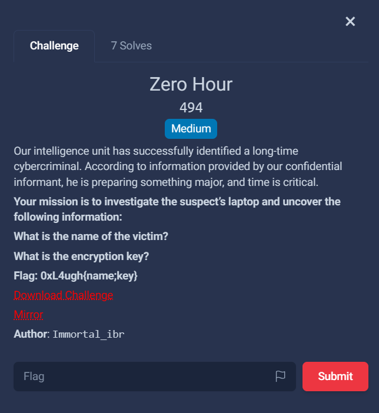


## Challenge Description


> Our intelligence unit has successfully identified a long-time cybercriminal. According to information provided by our confidential informant, he is preparing something major, and time is critical.
Your mission is to investigate the suspect’s laptop and uncover the following information:
- What is the name of the victim?
- What is the encryption key?

Flag format: `0xL4ugh{name;key}`


## Initial Assessment

### Provided Files

The challenge provides an AD1 forensic image file that we have extracted to an NTFS partition structure using FTK Imager:

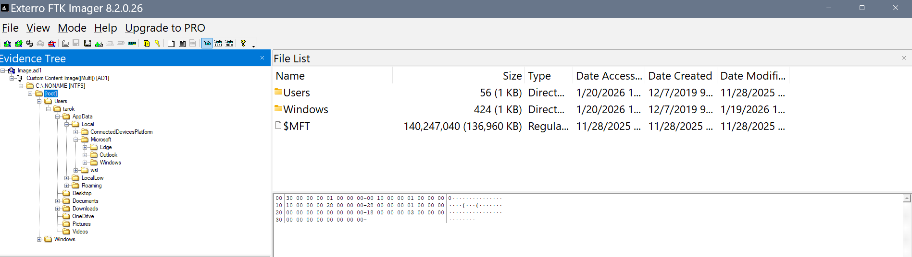

```
/forensics/Zero_Hour/
├── Image.ad1                    # Original forensic image (~962MB)
└── C___NONAME [NTFS]/[root]/    # Extracted NTFS partition
```


### Initial Reconnaissance

First, we explore the extracted file system structure to identify user accounts and installed applications:

```bash
# List the Users directory to find user accounts
ls -la "/mnt/c/ctf/_0xL4ugh/forensics/Zero_Hour/C___NONAME [NTFS]/[root]/Users/"
```

**Output:**
```
drwxrwxrwx 1 t4mpr t4mpr 4096 Jan 24 02:15 tarok
drwxrwxrwx 1 t4mpr t4mpr 4096 Jan 24 02:15 Default
drwxrwxrwx 1 t4mpr t4mpr 4096 Jan 24 02:15 Public
```

**Finding:** Primary user account is `tarok`

---

## Finding the Victim's Name

### Step 1: Identify Installed Applications

Check the user's Desktop for application shortcuts to understand what software was used:

```bash
ls -la "/mnt/c/ctf/_0xL4ugh/forensics/Zero_Hour/C___NONAME [NTFS]/[root]/Users/tarok/Desktop/"
```

**Output:**

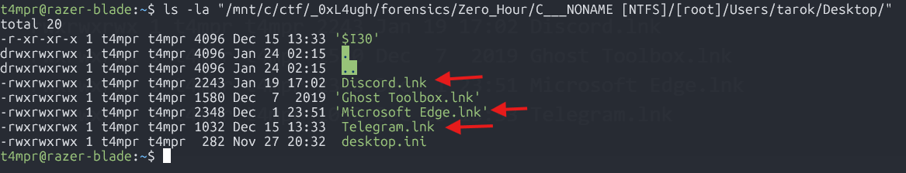

```
-rwxrwxrwx 1 t4mpr t4mpr 2243 Jan 19 17:02 Discord.lnk
-rwxrwxrwx 1 t4mpr t4mpr 1580 Dec  7  2019 Ghost Toolbox.lnk
-rwxrwxrwx 1 t4mpr t4mpr 2348 Dec  1 23:51 Microsoft Edge.lnk
-rwxrwxrwx 1 t4mpr t4mpr 1032 Dec 15 13:33 Telegram.lnk
```

**Key Finding:** User has Discord, Telegram.

### Step 2: Examine Browser History

Check Edge browser history for reconnaissance activity:

```bash
# Query the Edge History SQLite database
sqlite3 "/mnt/c/ctf/_0xL4ugh/forensics/Zero_Hour/C___NONAME [NTFS]/[root]/Users/tarok/AppData/Local/Microsoft/Edge/User Data/Default/History" \
"SELECT url, title, datetime(last_visit_time/1000000-11644473600,'unixepoch') as visit_time FROM urls ORDER BY last_visit_time DESC LIMIT 20;"
```

**Output (relevant entries):**
```
https://www.bing.com/search?q=ELJoOker|ELJoOker - Search
https://www.bing.com/search?q=k1r1to|k1r1to - Search
https://www.bing.com/search?q=Immotal_ibr|Immotal_ibr - Search
https://www.bing.com/search?q=Heisenberg|Heisenberg - Search
https://web.telegram.org/|Telegram Web - Telegram Login

```

**Finding:** Suspect was researching potential targets: ELJoOker, k1r1to, Immotal_ibr, Heisenberg and logged into Telegram

> `At this point I now realize that the forensic artifact that we are dealing with is the cyber criminal's Windows Filesystem`

### Step 3: Locate Communication Data

Check for Discord and Telegram data locations:

```bash
# Find Discord data
find "/mnt/c/ctf/_0xL4ugh/forensics/Zero_Hour/C___NONAME [NTFS]/[root]/Users/tarok/AppData/Roaming/discord" -type f 2>/dev/null | head -20
```
**Output (relevant entries):**
```
$I30
badge-1.ico - badge-11.ico
/1.0.9220/.first-run
data_0
data_0.FileSlack
data_1
data_1.FileSlack
data_2
data_3
```

**Finding:** Discord folder exists with leveldb data. Telegram Desktop folder referenced in shortcuts but not fully extracted.

### Step 4: Search Discord Local Storage

Extract strings from Discord's leveldb database:

```bash
strings -n 10 "/mnt/c/ctf/_0xL4ugh/forensics/Zero_Hour/C___NONAME [NTFS]/[root]/Users/tarok/AppData/Roaming/discord/Local Storage/leveldb/000005.ldb" | head -200
```

**Finding:** Contains Discord user configuration but messages are encrypted/stored server-side.

### Step 5: Locate Windows Push Notification Database (Key Step!)

Windows stores **Windows Push Notifications (WPN)** in a SQLite database called `wpndatabase.db`. This database often contains message previews from apps like Telegram and Discord - a goldmine for forensic investigators:

```bash
# Find the Windows Push Notification database
find "/mnt/c/ctf/_0xL4ugh/forensics/Zero_Hour/C___NONAME [NTFS]/[root]" -iname "*notification*" -o -iname "*wpn*" 2>/dev/null
```

**Output:**
```
/Users/tarok/AppData/Local/Microsoft/Windows/Notifications/wpndatabase.db
```
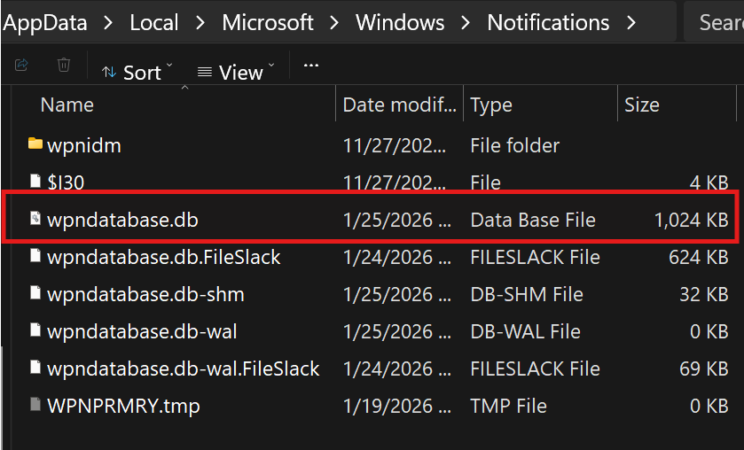


### Step 6: Query the Windows Push Notification Database

First, examine the database schema:

```bash
sqlite3 "/mnt/c/ctf/_0xL4ugh/forensics/Zero_Hour/C___NONAME [NTFS]/[root]/Users/tarok/AppData/Local/Microsoft/Windows/Notifications/wpndatabase.db" ".tables"
```

**Output:**
```
HandlerAssets        Notification         TransientTable
HandlerSettings      NotificationData     WNSPushChannel
Metadata             NotificationHandler
```


### Step 7: Extract Notification Payloads (Critical Step!)

**With  sqlite browser GUI:**

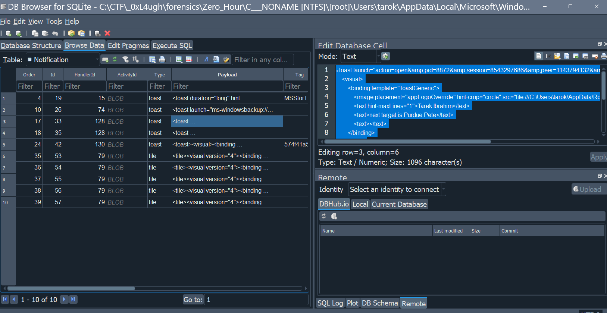


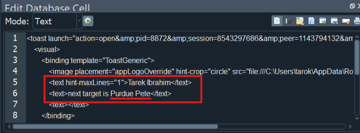


**Or in WSL Ubuntu terminal**
---
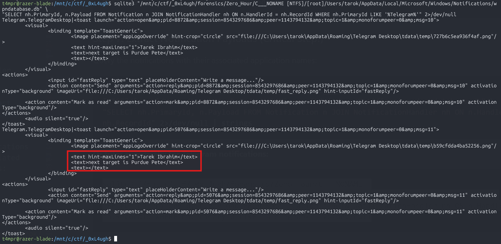


**VICTIM NAME FOUND: `Purdue Pete`**

The notification shows:
- **Sender:** Tarek Ibrahim
- **Message:** "next target is Purdue Pete"

This clearly indicates that **Purdue Pete** is the next victim targeted by the cybercriminal.

---


## Finding the Encryption Key:

This part of the challenge was done by some of my teammates at **L3ak** aka **P3ak** but here are the broad strokes of it.

#### Find the attacker's WSL ext4.vhdx image
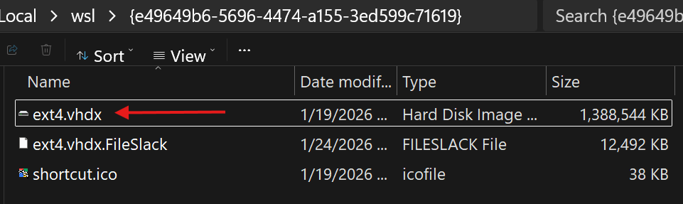

*This is the virtual disk image for **Windows Subsystem for Linux***

```powershell
 C:\CTF\_0xL4ugh\forensics\Zero_Hour\C___NONAME [NTFS]\[root]\Users\tarok\AppData\Local\wsl\{e49649b6-5696-4474-a155-3ed599c71619}\ext4.vhdx
 ```

Here we find a suspicious file `/home/kali/aresonal/setup.exe`

Carve it out and run it through VirusTotal and AnyRun to observe what it does.

### MITRE ATT&CK Tactics and Technique 
- **T1497** - Virtualization/Sandbox Evasion

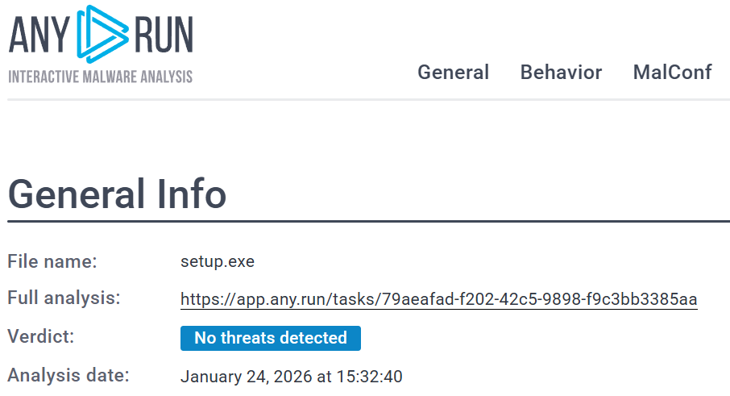

- The binary has "IsDebuggerPresent" checks 
- Patched the debugger checks out
- Set a breakpoint before the encryption happens.

`Set a breakpoint at 14000ab87`

```powershell
CC 2E 40 6C 5A 9C F1 20 22 56 67 23 89 78 1D 0E BE CB F7 3B BC 09 1B 03 5F 88 A4 1B 90 B7 B0 7F
```

**ENCRYPTION KEY FOUND: `cc2e406c5a9cf1202256672389781d0ebecbf73bbc091b035f88a41b90b7b07f`**


 

## Additional Context

### Geographic Correlation

The Windows weather widget data in the notifications shows:
- Location: **West Lafayette** (Indiana)
- This is the location of **Purdue University**
- **Purdue Pete** is Purdue University's official mascot

This confirms the target identification is consistent with the suspect's location/interest.


---


## Key Artifacts Summary

| Artifact | Location | Evidence |
|----------|----------|----------|
| Windows Push Notification DB | `Users/tarok/AppData/Local/Microsoft/Windows/Notifications/wpndatabase.db` | Contains Telegram message: "next target is Purdue Pete" |
| Edge Browser History | `Users/tarok/AppData/Local/Microsoft/Edge/User Data/Default/History` | Shows research on potential targets 
| Telegram Desktop | `Users/tarok/AppData/Roaming/Telegram Desktop/` | Communication app used to discuss targets |
| WSL Virtual Disk  | `\Users\tarok\AppData\Local\wsl\{e49649b6-5696-4474-a155-3ed599c71619}\ext4.vhdx` | WSL Virtual Machine Disk Image with ransomware binary `setup.exe`  |


---

## Lessons Learned

1. **Windows Push Notifications (WPN) are forensic gold** - The `wpndatabase.db` stores Windows Push Notification content including message previews from messaging apps like Telegram, Discord, and others. Located at `AppData\Local\Microsoft\Windows\Notifications\wpndatabase.db`
2. **Not ALL Telegram / Discord data is stored and encrypted server-side** - For bulletproof OPSec - Disable Windows Push Notifications. Your communication may be stored and encrypted server-side, but your Windows Push Notifications may be sticking around on your system longer than you realize.
3. **Check multiple data sources** - Browser history, Windows Push Notifications, and app data all provide different pieces of the puzzle

4. **Don't overlook system databases** - Windows stores much more data than users realize in system databases like the WPN database

---

## Tools Used

- [extract_notifications.sh](files/extract_notifications.sh) - script for extracting data from WPN database
- `DB Browser for SQLite` - Database GUI Application
- `Opus 4.5` - AI Assistant
- `sqlite3` - Database querying
- `strings` - Binary string extraction
- Eric Zimmerman's `MFTECmd.exe` - MFT parsing 

---

## Flag

```bash
0xL4ugh{PurduePete;cc2e406c5a9cf1202256672389781d0ebecbf73bbc091b035f88a41b90b7b07f}
```


- **Victim Name:** `Purdue Pete`
- **Encryption Key:** `cc2e406c5a9cf1202256672389781d0ebecbf73bbc091b035f88a41b90b7b07f`

---

## Contributors
- [VivisGhost](https://github.com/dbissell6/DFIR/tree/main/Blue_Book) - Check out his DFIR Blue Book here

- `White` L3ak Grandmaster

## Special Thanks

- Thank you to everyone on my team **L3ak / Lil L3ak / P3ak** who pushed through this 48 hour CTF to secure our 1st place finish

- Thank you 0xL4ugh for putting on this CTF 


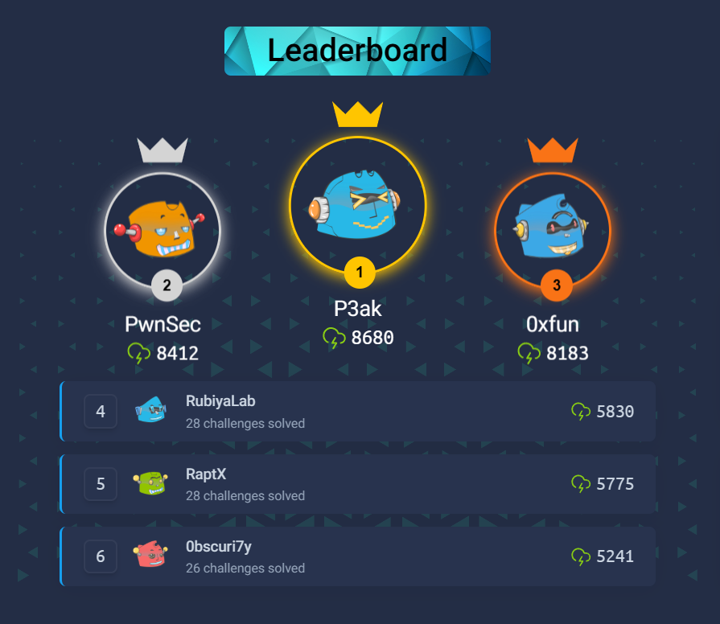
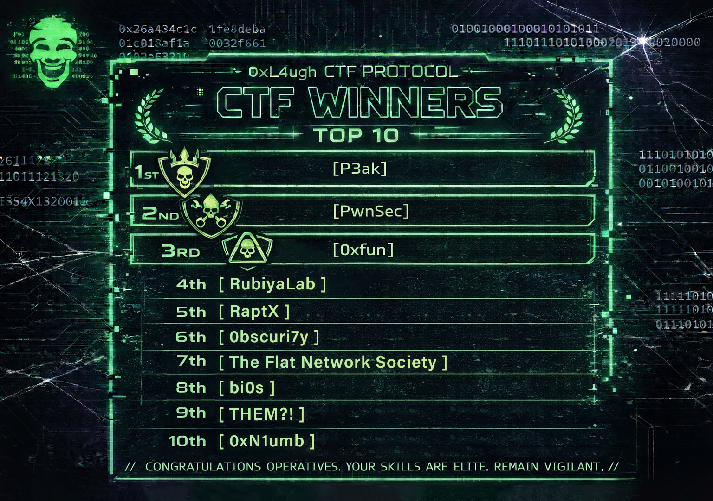

## Fun Facts
 - Web challenges had 5 zero-days
 - DFIR challenges were based on unpublished research
 - One-of-a-kind challenges across all categories

## References


- [Windows Push Notification Services (WNS) overview - Microsoft Docs](https://docs.microsoft.com/en-us/windows/apps/design/shell/tiles-and-notifications/windows-push-notification-services--wns--overview)
- [VirusTotal setup.exe ](https://www.virustotal.com/gui/file/ed956cd5bff51064e637c93d76b0b89e9221f7db46c4463ff6f441be40dfa089/detection) `0ce81c7fca7f74f76e9b89ef47ca85e5`
- [AnyRun setup.exe](https://app.any.run/tasks/79aeafad-f202-42c5-9898-f9c3bb3385aa) `0ce81c7fca7f74f76e9b89ef47ca85e5`
- [Purdue Pete - Purdue University Mascot](https://en.wikipedia.org/wiki/Purdue_Pete)


