## Buckeye CTF 2025 - Bugle Walkthrough

### Forensics / Bugle
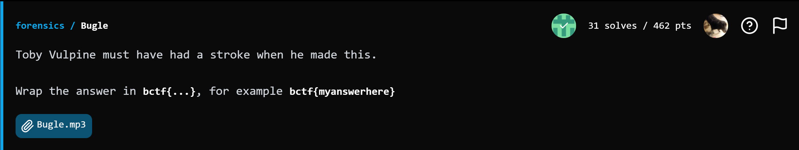

> Toby Vulpine must have had a stroke when he made this.
>> Wrap the answer in bctf{...}, for example bctf{myanswerhere}

File provided: [`Bugle.mp3`](files/Bugle.mp3)

This was a fun challenge.  We're provided with an mp3 audio file that sounds like a trumpet playing a song.
If we analyze the audio file through various Spectogram Analysis tools, nothing obvious comes to mind.

## Morse Code

- Google defines **Morse code** as `an alphabet or code in which letters are represented by combinations of long and short signals of light or sound.`

- **Morse Code** is a form of encoding can be integrated into steganographic methods by hiding the Morse code signals within an innocuous "cover" medium in a way that conceals the very existence of a hidden message can be delivered in many formats, spikes in volume, light, patterns, tones...

## Audio File Analysis

We can start by simply listening to and viewing the audio in any DAW or audio visualization tool.  

- Let's start with Sonic Visualizer

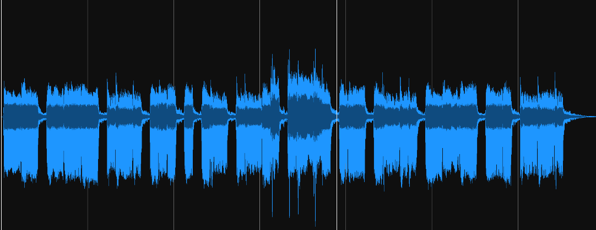

Hmmm...Nothing too obvious here.  However, we do see some clean breaks in-between notes.  This could be an indicator that this may be morse code.  

> ##### When analyzing Morse Code, we need SOMETHING in between `-` and `.` - A space, a consistent break.  Something to tell us where to separate each character.

If we load this up into an online tool [MusicGram](https://musitools.xyz/musigram/),
  we see further confirmation of **Morse Code**

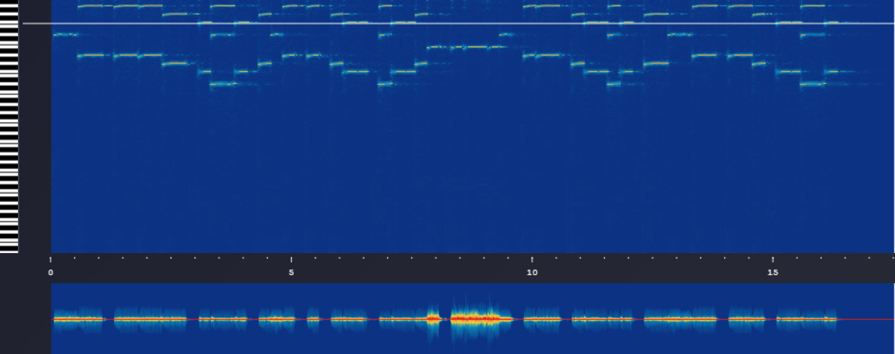

*"How is this Morse Code?"*  You may ask...

## Let's take a closer look...

Load the .mp3 into your DAW *(Digital Audio Workstation)* of choice...
- For this example, I use **Ableton 12**

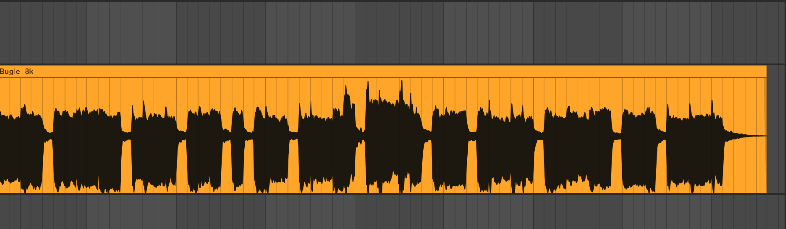

##### ...Now do you see it?

 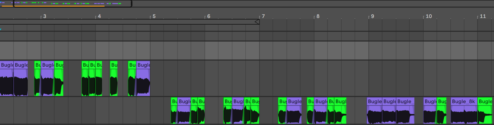

﴾͡๏̯͡๏﴿ 
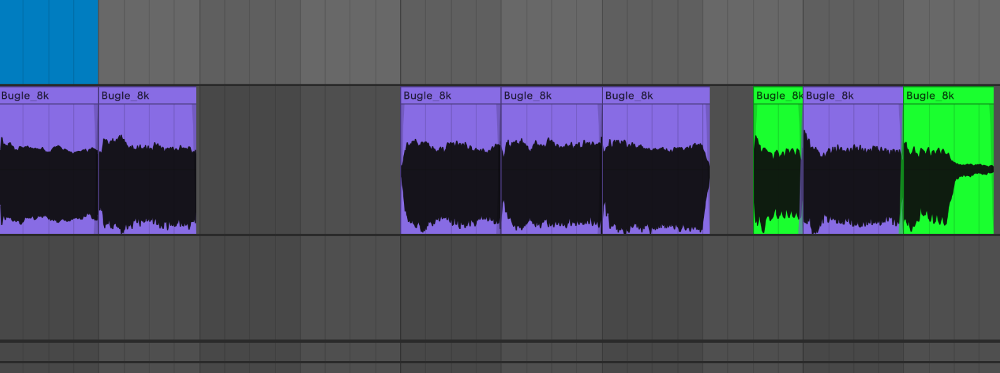

#### ...How about now?

### Aha! NOW we're getting the hang of it! 
( ━☞´◔‿ゝ◔`)━☞ 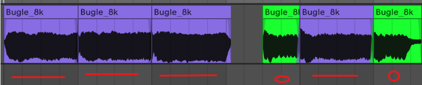
#### 

 > In  Ableton Grid view, a 1/4 of a bar is shown by zooming in. Notice the two different shades of grey.  If you're not familiar with Ableton, just think of one of those grey blocks as one quarter of a bar.

- ##### Notes that play for 1/4 of a bar represents a `-`  
 
- ##### Notes that play for 1/8 of a bar represent a `.` 

I chopped each note individually and cut all of the negative space to isolate each character.  This helped me visualize the `-`'s and `.`'s

> I've included the [Chopped Bugle Audio](files/Bugle_chopped.mp3) file here as well.

 If you go through the entire audio file, listening to each note and color-coding them for easy visualization, you'll end up with `-- --- .-. ... . .- .-.. .-.. .- .-.. --- -. --.`

You can then use [CyberChef](https://gchq.github.io/CyberChef/#recipe=From_Morse_Code('Space','Line%20feed')&input=LS0gLS0tIC4tLiAuLi4gLiAuLSAuLS4uIC4tLi4gLi0gLi0uLiAtLS0gLS4gLS0u&ieol=CRLF) or another Morse Code Decoder to recover the decoded message.

## Visual Representation

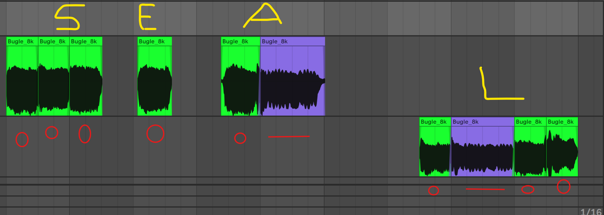
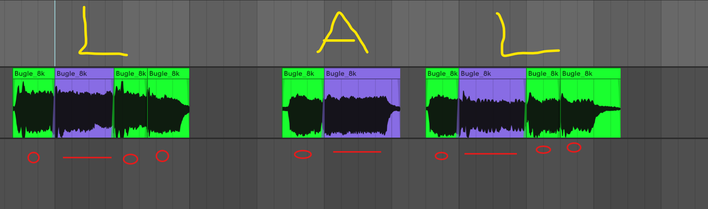

## Alternative Solution

Rather than having to load the audio into a DAW, chop the notes up and color-code everything while manually listening and taking notes. You could use the [Musicgram spectrogram tool](https://musitools.xyz/musigram/) and decode the morse just by looking at it...

But *"How?"* You may ask... 
##### 

###### (ง'̀-'́)ง 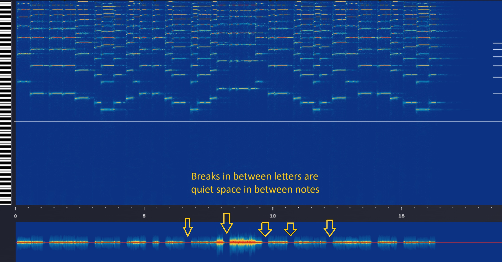

- This is important when trying to decode morse, **knowing where the breaks are**, otherwise you'll end up something totally different than what is intended to be decoded.
- If you don't understand where the breaks are, you may end up convincing yourself that **it's not Morse Code.  (╯°□°）╯︵ ┻━┻** 

#### Visual Representation of Bugle.mp3 decoded using [musitools.xyz/musigram](https://musitools.xyz/musigram/)

###### ♪~ ᕕ(ᐛ)ᕗ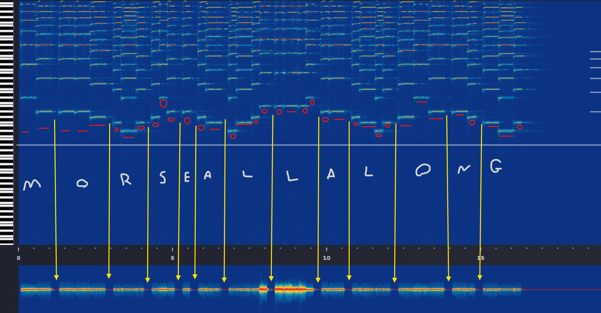

## Conclusion

Flag - `bctf{MORSEALLALONG}`

- Shout out to the [Buckeye CTF](https://pwnoh.io/) Staff for putting on a great event

- And of course my team, [L3ak](https://l3ak.team/) for coming in 1st place in the Open Division 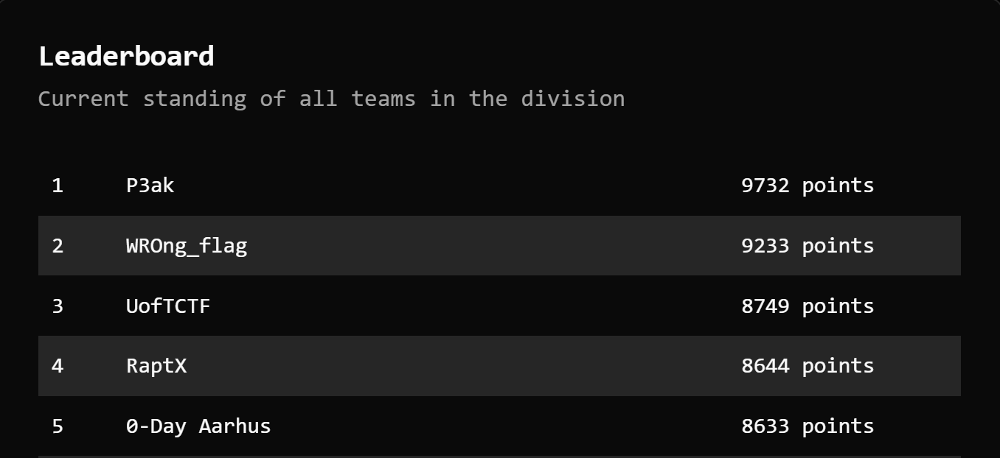

##### *If you enjoyed this walkthrough.  Please give this repo a ⭐ and follow my GitHub for more*
###### Feel free to DM me on Discord or LinkedIn if you have any questions.

 

## Helpful Morse Code Resources

- [musitools.xyz/musigram](https://musitools.xyz/musigram/)

- [https://morsecode.world/](https://morsecode.world/)
- [Cyber Chef](https://gchq.github.io/CyberChef/#recipe=From_Morse_Code('Space','Line%20feed')&input=LS0gLS0tIC4tLiAuLi4gLiAuLSAuLS4uIC4tLi4gLi0gLi0uLiAtLS0gLS4gLS0u&ieol=CRLF)

