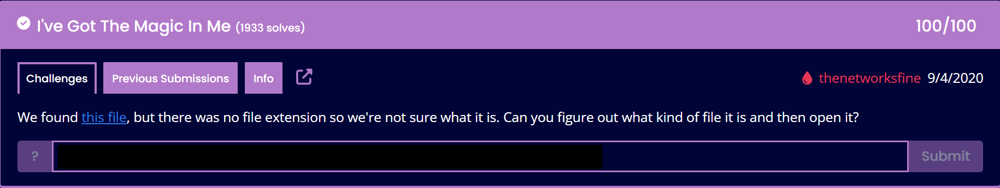
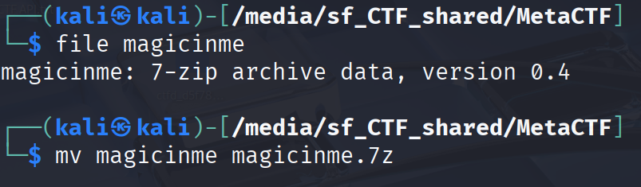
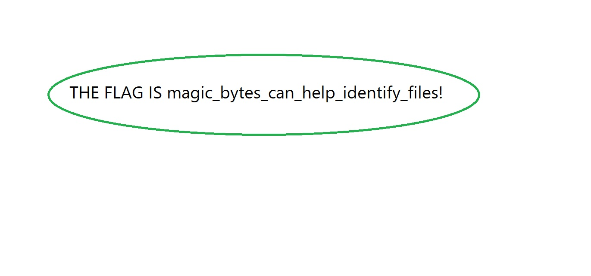
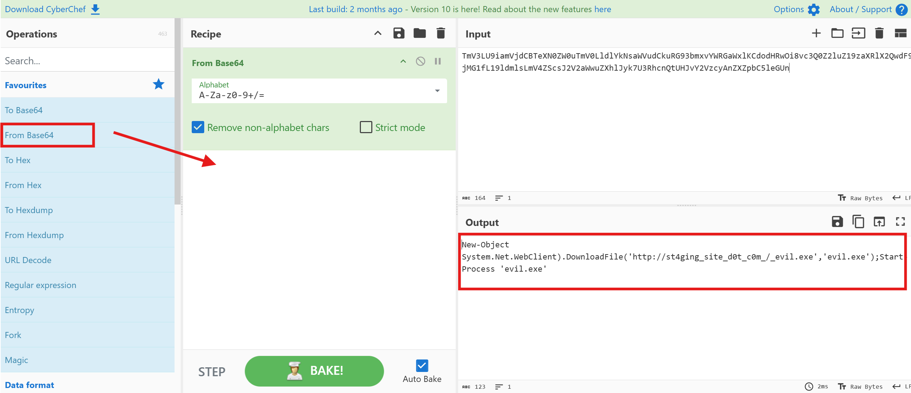
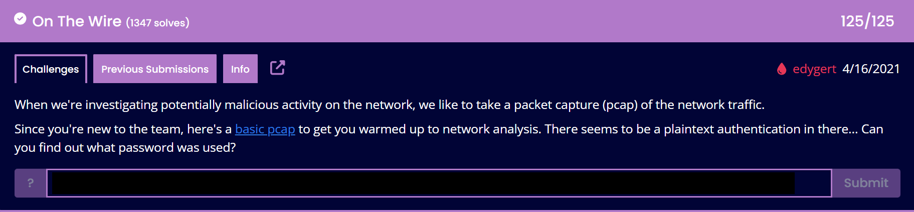
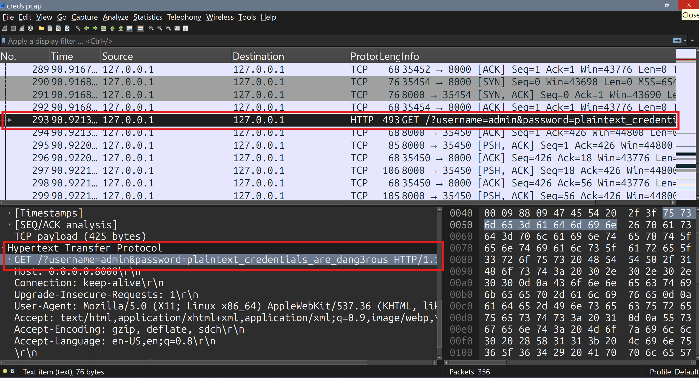

# MetaCTF — Walkthroughs

## Challenges

**I've Got The Magic**

File provided: [`magicinme`](files/magicinme)

by typing `file magicinme` into our termianl - we discover the file type without the file having the correct extention. (i.e .7z or .zip)

We then change add the correct extention to the file `mv magicinme magicinme.7z`

 

Then, we unzip with `7z e magicinme.7z`

open the file with `xdg-open flag.jpg`

Retrieve the flag

---

**Forensics, Here I Come**

`xxd -l 2 [filename]`

Breakdown of the command:
- xxd: Creates a hex dump of a file.
- -l 2: Limits the output to the first 2 bytes.
- [filename]: The file you want to examine.

Example output for a Windows executable:

---

**Can PowerShell Please Join Us On the Stage?**

To solve this we take the base64 encoded blob and throw it in to [Cyberchef](https://gchq.github.io/CyberChef/) selecting `From Base64` and dragging it into the `Recipe` Section

---

**On The Wire**

Opening the provided [.pcap file](files/creds.pcap) in Wireshark shows plaintext unencrypted credentials  

---

**Anonymoose**

Using exiftool we are able to view the metadata in the [provided .pdf](files/D34DM0053_Open_Letter_Mental_Health.pdf)

---

See you next time!

-[t4mpr](https://linkedin.com/in/smosillo)

