# MetaCTF — Forensics Walkthroughs

## I've Got The Magic

File provided: [`magicinme`](files/magicinme)

by typing `file magicinme` into our termianl - we discover the file type without the file having the correct extention. (i.e .7z or .zip)

We then change add the correct extention to the file `mv magicinme magicinme.7z`

 

Then, we unzip with `7z e magicinme.7z`

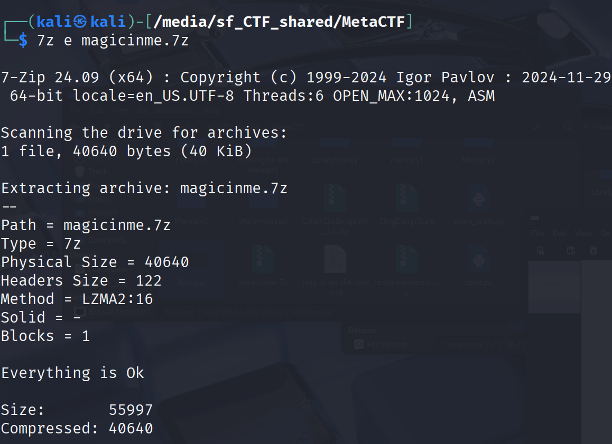

open the file with `xdg-open flag.jpg`

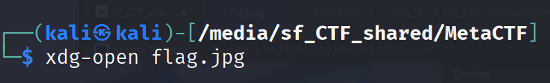

Retrieve the flag

## Forensics, Here I Come

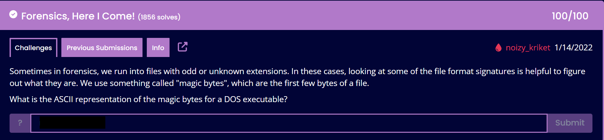

`xxd -l 2 [filename]`

Breakdown of the command:
- xxd: Creates a hex dump of a file.
- -l 2: Limits the output to the first 2 bytes.
- [filename]: The file you want to examine.

Example output for a Windows executable:
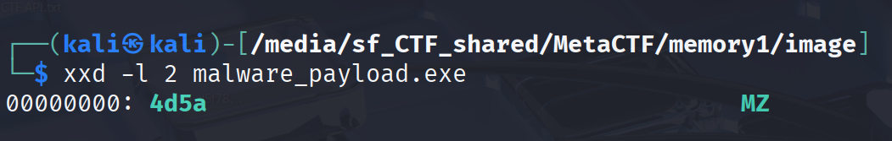

## Can PowerShell Please Join Us On the Stage?

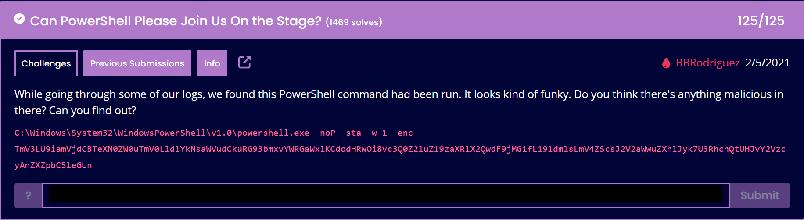

To solve this we take the base64 encoded blob and throw it in to [Cyberchef](https://gchq.github.io/CyberChef/) selecting `From Base64` and dragging it into the `Recipe` Section

## On The Wire

Opening the provided [.pcap file](files/creds.pcap) in Wireshark shows plaintext unencrypted credentials  

## Anonymoose

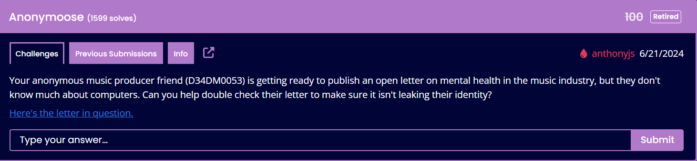

Using exiftool we are able to view the metadata in the [provided .pdf](files/D34DM0053_Open_Letter_Mental_Health.pdf)

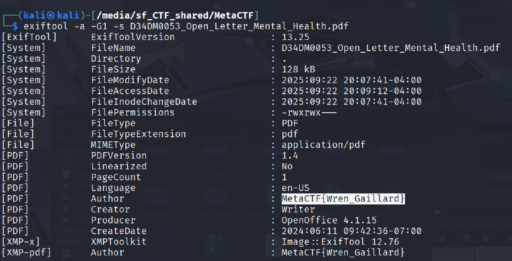

## runCAPTCHA

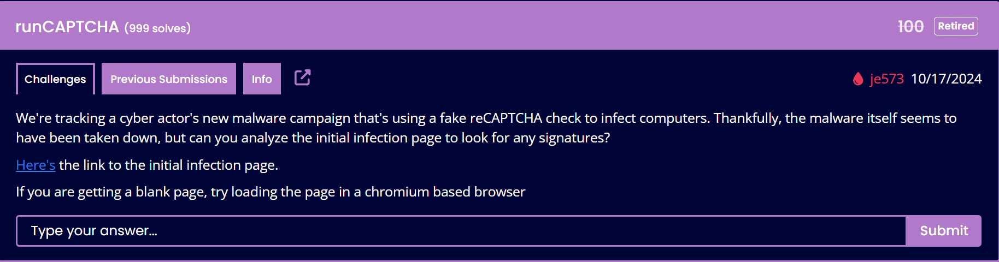

Visiting the provided [URL](https://metaproblems.com/3bd33118c7a7faa98c23c76ea8aa782e/) - Right click > Inspect brings up Google Chrome's Developer Tools

We find a function that looks suspicious
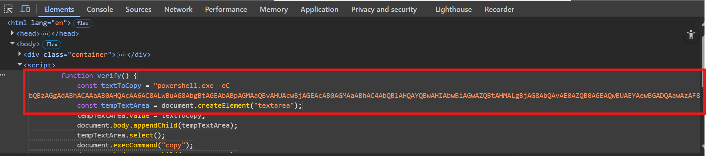

From here we take this Base64 blob and bring it in to [Cyberchef](https://gchq.github.io/CyberChef/#recipe=From_Base64('A-Za-z0-9%2B/%3D',true,false)Decode_text('UTF-16LE%20(1200)')&input=YlFCekFHZ0FkQUJoQUNBQWFBQjBBSFFBY0FBNkFDOEFMd0J1QUc4QWJnQnRBR0VBYkFCcEFHTUFhUUJ2QUhVQWN3QmpBR0VBY0FCMEFHTUFhQUJoQUM0QWJRQmxBSFFBWVFCd0FISUFid0JpQUd3QVpRQnRBSE1BTGdCakFHOEFiUUF2QUUwQVpRQjBBR0VBUXdCVUFFWUFld0JHQURRQWF3QXpBRjhBWXdBMEFIQUFWQUJqQUdnQVFBQnpBRjhBY2dCMUFFNEFYd0J0QURRQWJBQjNBRFFBY2dBekFIMEE&oenc=65001) Using the `From Base64` and `Becode Text UTF-16LE (1200)` given that this looks to be Base64 encoded and we see this `powershell.exe -eC` 

In PowerShell, the flag -eC (or -EncodedCommand) tells PowerShell to expect the following argument as a Base64-encoded string that represents the script/command to run.

> "Becode Text UTF-16LE (1200)" refers to the process of decoding or interpreting text that has been encoded using the UTF-16 Little Endian (LE) character encoding, specifically using code page ID 1200, which is commonly associated with UTF-16LE in Microsoft environments like .NET and PowerShell."

From here we find the malicious URL and our flag

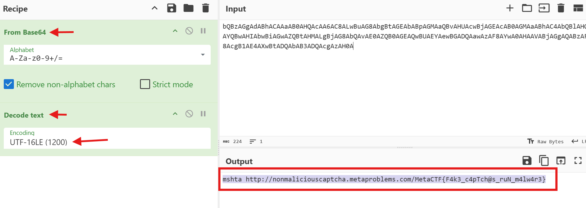

## Browser, Wowser
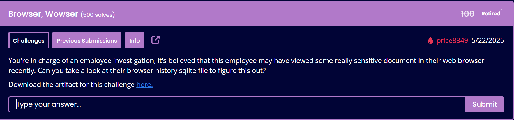

Knowing what we are looking for  `"MetaCTF"`  If we wanted to find the flag with  minimal effort we could just run
`strings places.sqlite | grep MetaCTF{`

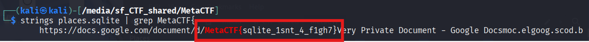

## Spam to Ham
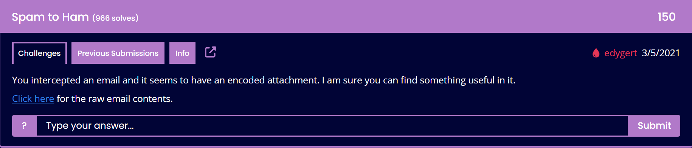

This challenge gives us an [email](files/spam_not_ham.txt) that was intercepted that has some base64 encoded contents. If we inspect the file we see that the message contains a clue `I've attached an image in this email` 
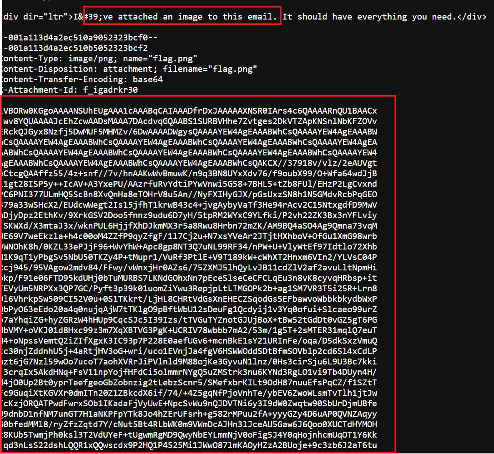 

Taking the very large base64 encoded blob and putting it into Cyberchef gives us a hint.

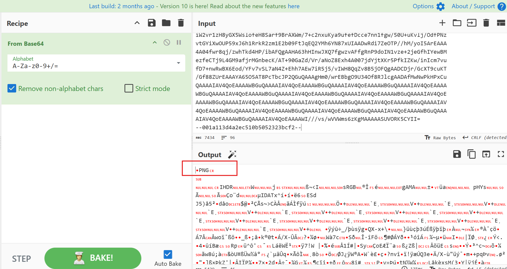

This is likely a PNG file!

copy the base64 into a file named flag.64
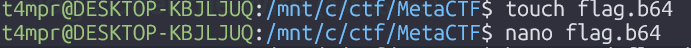
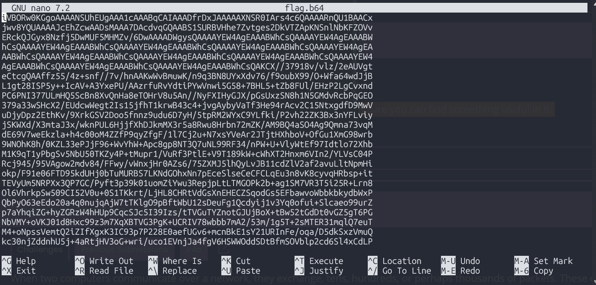

I use `file` to check that the file type is in fact PNG image data,then `base64 -d flag.64 > flag_64.png` to turn the base64 into a .png and open the image 
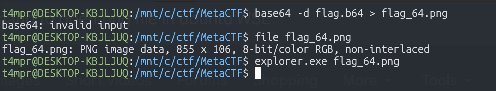

Because I am using WSL Ubuntu, I just use `explorer.exe` to open the file. 

## Remote Data Pwnage
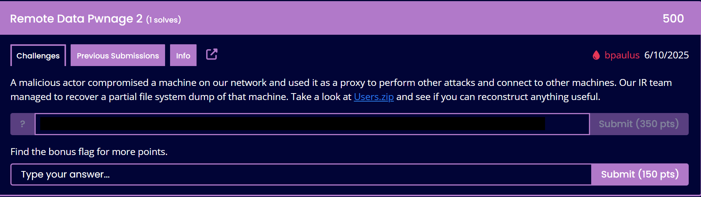

>"A malicious actor compromised a machine on our network and used it as a proxy to perform other attacks and connect to other machines. Our IR team managed to recover a partial file system dump of that machine. Take a look at [Users.zip](https://range.metaproblems.com/739c7a4b6b9d8d9281bb3a4c964e68ca/Users.zip) and see if you can reconstruct anything useful."

Looking in C:\Administrator\AppData\Local\Microsoft\Terminal Server Client\Cache\ we find a .bin file
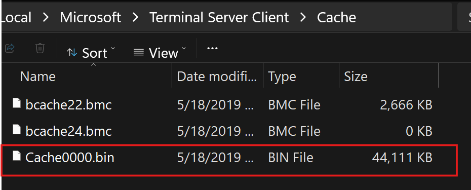

We can use [bmc-tools.py](https://github.com/ANSSI-FR/bmc-tools/blob/master/bmc-tools.py) to extract thousands of image fragments to try to get some clues on what was shown on the scren during the RDP session

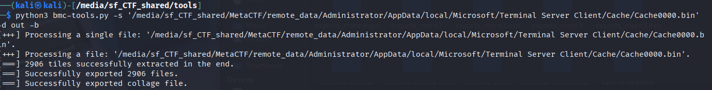

The entire collage looks like this.

Very difficult to try to figure out what is going on here.

For this, we use yet another incredible tool - [RdpCacheStitcher](https://github.com/BSI-Bund/RdpCacheStitcher)

This can be quite time consuming to piece together all of these individual frames to get a full picture.  Here is a screen-shot of this [RdpCacheStitcher](https://github.com/BSI-Bund/RdpCacheStitcher) for context

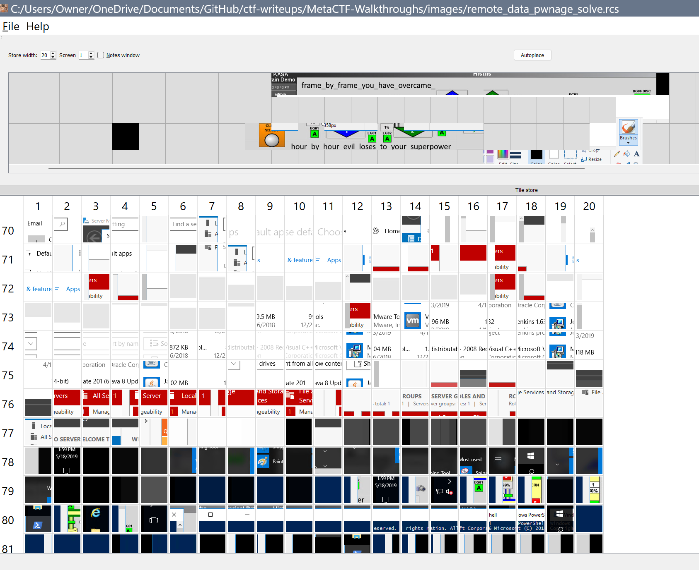

From here we can take frames and try to piece them together manually.  This is like putting together pieces of a puzzle but for digital forensics

There's our flag.

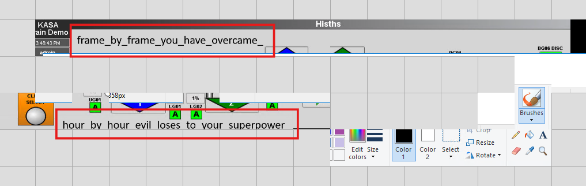 

See you next time!

-[t4mpr](https://linkedin.com/in/smosillo)

