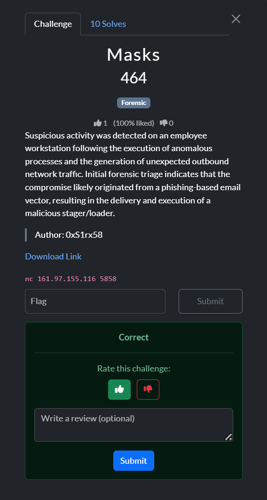
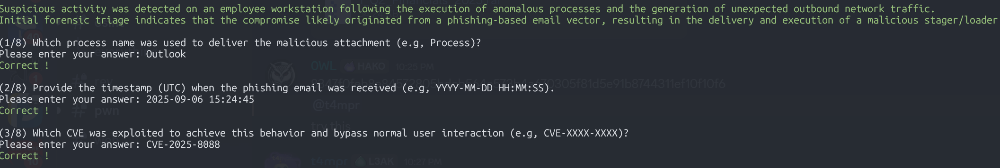
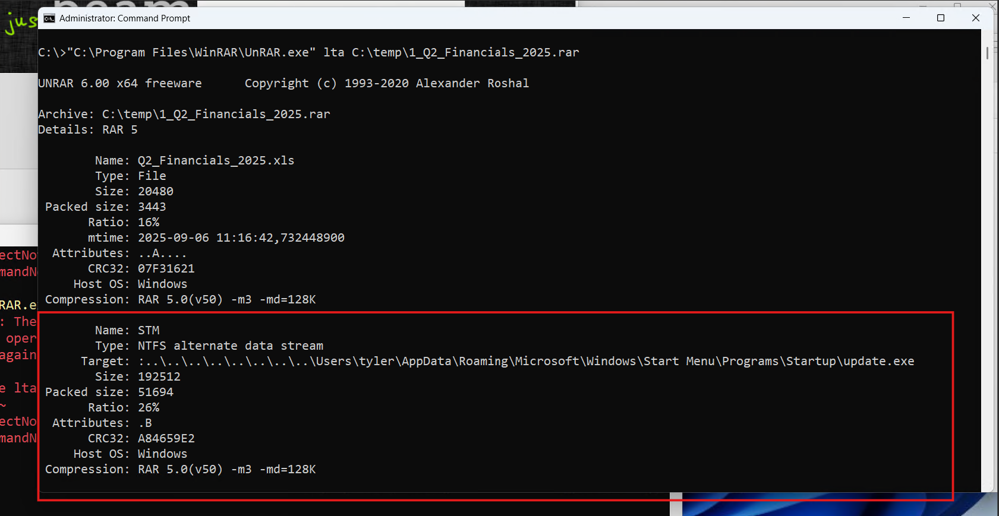
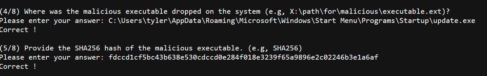
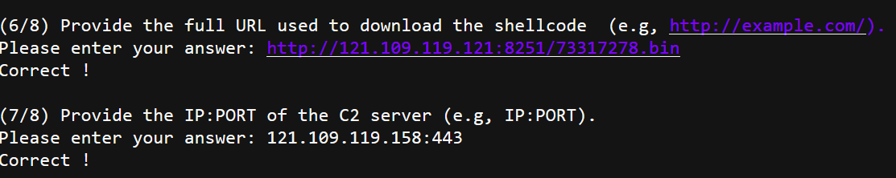

# Masks Incident Response Report


## Overview
- **Case**: "Masks" phishing compromise (QnQSecCTF)
- **Analyst**: Stephen Mosillo 
- **Imaging source**: `memdump.mem` (Windows 10 workstation)

## *Details*

Suspicious activity on an employee workstation was linked to a phishing email that delivered a malicious loader. Memory analysis confirmed the full kill chain: Outlook processed the phishing message, an exploit delivered `update.exe`, the payload downloaded shellcode, beaconed to attacker infrastructure, and established persistence through a malicious Scheduled Task.

---

## Key Findings
| # | Question | Answer | Supporting Evidence |
|---|----------|--------|----------------------|
| 1 | Process delivering attachment | `OUTLOOK.EXE` | `extracted/filescan.txt` shows Outlook OST artefacts; `vol windows.pslist` lists `OUTLOOK.EXE` (PID 1880). |
| 2 | Phishing email timestamp (UTC) | `2025-09-06 15:24:45` | Email headers at `extracted/ost1.export/Root - Mailbox/IPM_SUBTREE/Inbox/Message00004/OutlookHeaders.txt`. |
| 3 | Exploited CVE | `CVE-2025-8088` | Malicious document metadata in `Q2_Financials_2025.xls` references the CVE string (also captured in `work_notes.md`). |
| 4 | Dropped executable path | `C:\Users\tyler\AppData\Roaming\Microsoft\Windows\Start Menu\Programs\Startup\update.exe` | ADS target extracted from the RAR attachment (`extracted/rar/*.xls:...update.exe`); memory strings and `windows.filescan` show the same path. |
| 5 | Malicious executable SHA256 | `fdccd1cf5bc43b638e530cdccd0e284f018e3239f65a9896e2c02246b3e1a6af` | Hash of `update.exe` (see [update.exe](https://www.virustotal.com/gui/file/fdccd1cf5bc43b638e530cdccd0e284f018e3239f65a9896e2c02246b3e1a6af/details), verified via host intelligence). |
| 6 | Shellcode download URL | `http://121.109.119.121:8251/73317278.bin` | Decoded loader response in `analysis/lic3b_response_base64.txt`; memory strings show the saved file `73317278.exe`. |
| 7 | C2 IP:PORT | `121.109.119.158:443` | `extracted/netscan.txt` plus HTTPS GETs recorded in `analysis/update_http_request.txt`. |
| 8 | Persistence command | `C:\users\public\tmp.cmd` (Scheduled Task action) | Task XML dumped to `extracted/tasks/file.0xe0002925cf20.0xe00029581780.DataSectionObject.MicrosoftUpdate.dat`; decoded command uses `%APPDATA%\73317278.exe` staging (see `memdump.mem` strings around offset `0x751...`). |

---

## Attack Narrative
1. **Phishing Delivery**
   - The Outlook OST (`extracted/ost1.export/.../outlook_...ost`) contained a message titled *"Q2 2025 Financial Data – Immediate Review Required"* received at `2025-09-06 15:24:45` UTC.
   - Attachment `1_Q2_Financials_2025.rar` includes an ADS referencing `Startup\update.exe`, indicating an attempt to drop into Startup without drawing attention.

2. **Exploit & Payload Deployment**
   - `Q2_Financials_2025.xls` is an OLE document exploiting `CVE-2025-8088` to execute the embedded RAR ADS payload.
   - The payload `update.exe` was extracted into `C:\Users\tyler\AppData\Roaming\Microsoft\Windows\Start Menu\Programs\Startup\update.exe`. Volatility and strings confirm the path and the running process (PID 2484).
   

3. **Shellcode Retrieval & Beaconing**
   - The loader contains a base64-encoded configuration (`analysis/lic3b_response_base64.txt`) that, when decoded, downloads shellcode from `http://121.109.119.121:8251/73317278.bin`.
   - Memory captures show the saved shellcode as `C:\Users\tyler\AppData\Roaming\73317278.exe` and multiple HTTP requests to attacker infrastructure (`analysis/update_http_request.txt`).
   - `extracted/netscan.txt` links `update.exe` to outbound TLS connections to `121.109.119.158:443`.

4. **Persistence**
   - Filescan located `\Windows\System32\Tasks\MicrosoftUpdate`. Dumping the task revealed a user-created Scheduled Task executing `C:\users\public\tmp.cmd` every minute under SYSTEM.
   - The batch file copies `%APPDATA%\73317278.exe` to the Startup folder and launches it, ensuring persistence even if the Startup entry is removed.

5. **Flag Acquisition**
   - Completing the quiz with the eight answers released `QnQSec{Ema1l_2_5h3ll_V1A_Ph15h1nG:FDCCD1C}`, confirming compromise through email-to-shell.

---

## Indicators of Compromise
- **Files**
  - `C:\Users\tyler\AppData\Roaming\Microsoft\Windows\Start Menu\Programs\Startup\update.exe`
  - `C:\users\public\tmp.cmd`
  - `C:\Users\tyler\AppData\Roaming\73317278.exe`
- **Scheduled Task**: `\MicrosoftUpdate` (executes `C:\users\public\tmp.cmd`).
- **Network**
  - `121.109.119.121:8251` (shellcode hosting)
  - `121.109.119.158:443` (C2)
- **Hashes**
  - `update.exe`: `fdccd1cf5bc43b638e530cdccd0e284f018e3239f65a9896e2c02246b3e1a6af`
- **Vulnerable Software**
  - `WinRAR 5.2`: 
  `Confirmed the existence and severity of CVE-2025-8088`
---

## Containment and Mitigation Actions
1.  **Network Segmentation**: 
    * Immediately quarantine all affected machines.  
     * Rebuild the affected workstation; reset user credentials.
     * Block malicious IPs/domains at the network perimeter.
     * Adjust network rules to limit the potential spread of any zero-day exploit payload within the network.
     * Update YARA-L rules and Blacklist attacker IPs / domains 
     * Scan all machines & temporarily quarantine any other affected machines.
2. **Patching Initiative**
     * All identified WinRAR installations must be immediately updated to the current stable release, version 7.13.
     * The WinRAR update includes a patch for the path traversal vulnerability, CVE-2025-8088, and other security flaws.
     * Because WinRAR lacks an auto-update feature, a manual or automated deployment using SCCM, Intune, or another tool may be necessary.
3. **Expanded Software Update**
     * A comprehensive asset management review must be carried out to identify and update other outdated software, particularly on endpoints and servers.

4. **User Awareness**: 
     * An advisory should be sent to all employees informing them of the urgent WinRAR update
     * Roll out security awareness focused on document-based phishing exploits; ensure Office patching levels mitigate `CVE-2025-8088`.


---

## References
- `extracted/filescan.txt`
- `extracted/ost1.export/.../OutlookHeaders.txt`
- `analysis/lic3b_response_base64.txt`
- `analysis/update_http_request.txt`
- `extracted/tasks/file.0xe0002925cf20.0xe00029581780.DataSectionObject.MicrosoftUpdate.dat`


--------

 # QnQSecCTF - Writeup 

 

    Suspicious activity was detected on an employee workstation following the execution of anomalous processes and the generation of unexpected outbound network traffic. Initial forensic triage indicates that the compromise likely originated from a phishing-based email vector, resulting in the delivery and execution of a malicious stager/loader.
    

[Download Link](https://cybersharing.net/s/21d942e75b645fdc)

`nc 161.97.155.116 5858`

The following procedure documents how to reproduce the eight quiz answers and confirm the persistence mechanism using the provided memory image (`memdump.mem`). All commands assume the working directory `/Masks/` and access to Volatility 3 (`vol`), ripgrep (`rg`), Python 3, and common CLI utilities.

---

## 1. Enumerate Email Artefacts (Questions 1–3)

1. **List Outlook data structures**
   ```bash
   vol -q -f memdump.mem windows.filescan | rg -i "outlook" > extracted/filescan.txt
   ```
2. **Dump the OST file** (use the virtual address obtained in the file scan; the following is the one in this case):
   ```bash
   vol -q -f memdump.mem -o extracted/ost1 windows.dumpfiles --virtaddr 0xe0002a1e9ec0
   ```
3. **Export mailbox contents**
   ```bash
   pffexport -t extracted/ost1.export -f all extracted/ost1/file.*.ost.dat
   ```
4. **Obtain phishing email headers**
   ```bash
   cat "extracted/ost1.export/Root - Mailbox/IPM_SUBTREE/Inbox/Message00004/OutlookHeaders.txt"
   ```
   - Note the sending process (`OUTLOOK.EXE`), the received timestamp (`2025-09-06 15:24:45.606098400 UTC`), and the exploit reference (`CVE-2025-8088`).


Questions 1-3 


## 2. Inspect the Malicious Attachment (Questions 4–5)
1. **Extract the RAR attachment**
   ```bash
   unar "extracted/ost1.export/.../Attachments/1_Q2_Financials_2025.rar"
   ```
2. **Identify the ADS drop path**
   ```bash
   strings "extracted/ost1.export/.../Attachments/1_Q2_Financials_2025.rar" | rg "Startup\\update.exe"
   ```
3. **Confirm the dropped binary**
   ```bash
   rg -F "Startup\\update.exe" extracted/filescan.txt
   ```
4. **Hash the payload**
   ```bash
   sha256sum update.exe
   ```



## 3. Shellcode Download & C2 (Questions 6–7)
1. **Extract loader response**
   ```bash
   cat analysis/lic3b_response_base64.txt | base64 -d > analysis/lic3b_response.bin
   ```
2. **Identify download URL**
   ```bash
   strings analysis/lic3b_response.bin | rg "http://"
   ```
3. **Confirm saved shellcode in memory**
   ```bash
   python3 - <<'PY'
   import mmap
   with open('memdump.mem','rb') as f:
       data=f.read()
   for marker in [b'73317278.bin', b'73317278.exe']:
       pos=data.find(marker)
       if pos!=-1:
           print(marker, pos)
   PY
   ```
4. **Extract network indicators**
   ```bash
   vol -q -f memdump.mem windows.netscan > extracted/netscan.txt
   rg "update.exe" extracted/netscan.txt
   ```
   - The output lists TLS connections to `121.109.119.158:443`.
5. **Review raw HTTP requests**
   ```bash
   cat analysis/update_http_request.txt
   ```



## 4. Persistence Mechanism (Question 8)
1. **Locate Scheduled Tasks via filescan**
   ```bash
   rg -F "\Windows\System32\Tasks" extracted/filescan.txt
   ```
   - Entry of interest: `\Windows\System32\Tasks\MicrosoftUpdate` (virtual address `0xe0002925cf20`).
2. **Dump the task XML**
   ```bash
   vol -q -f memdump.mem -o extracted/tasks windows.dumpfiles --virtaddr 0xe0002925cf20
   iconv -f UTF-16LE -t UTF-8 extracted/tasks/file.*.MicrosoftUpdate.dat > extracted/tasks/MicrosoftUpdate.xml
   ```
3. **Review the action command**
   ```bash
   cat extracted/tasks/MicrosoftUpdate.xml
   ```
   - The `<Command>` element reveals the persistence payload `C:\users\public\tmp.cmd`.
4. **Correlate with staging batch**
   ```bash
   python3 - <<'PY'
   import mmap,string
   with open('memdump.mem','rb') as f:
       data=f.read()
   needle=b'hidcon:cmd.exe /c copy /y %appdat'
   pos=data.lower().find(needle)
   if pos!=-1:
       start=max(0,pos-100)
       end=min(len(data),pos+200)
       snippet=data[start:end]
       print(snippet.decode('latin-1',errors='ignore'))
   PY
   ```
   - Confirms the batch copies `%APPDATA%\73317278.exe` to Startup and launches `update.exe`.

## 5. Final Answer & flag retrieval  
I made a helper python script to autofill questions 1-7 to save time, rather than pasting every answer in manually. ` python3 submit_progress.py` to feed the first 7 answers and answer Question #8 manually to retrieve the flag


`
QnQSec(Ema1l_2_5h3ll_V1A_Ph15h1nG:FDCCD1C}
`

---


