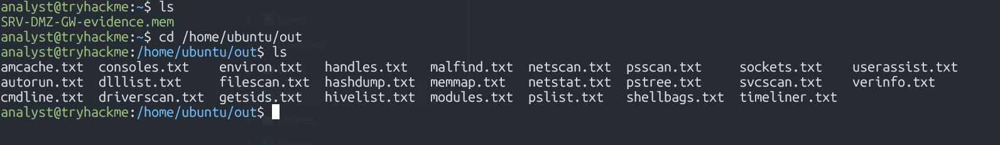
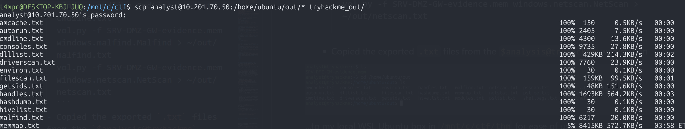
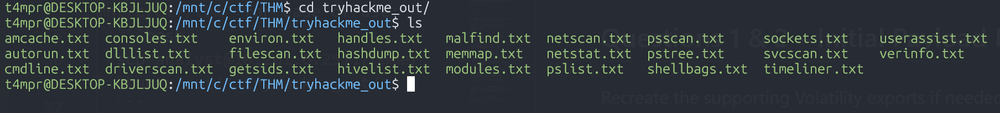
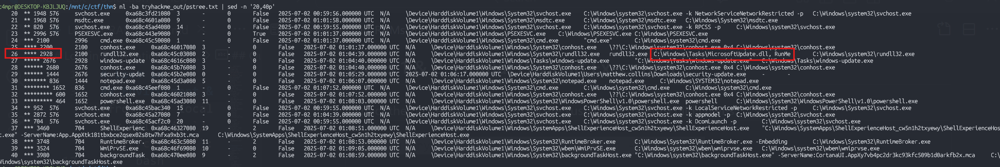
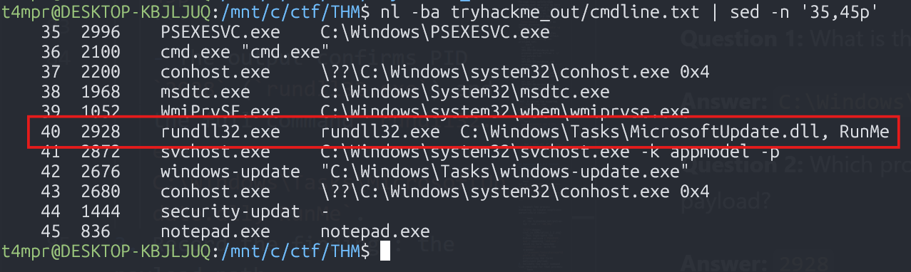
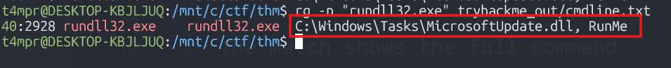
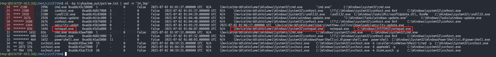
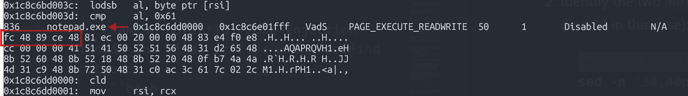
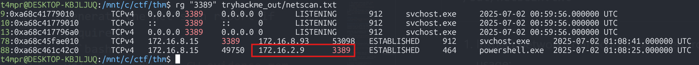
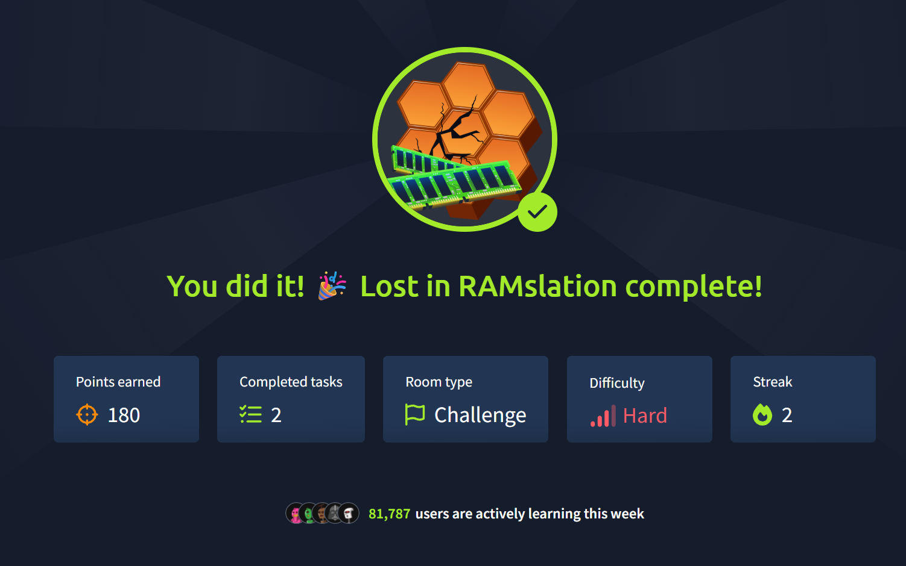

# TryHackMe - Lost in RAMslation Walkthrough 

<div style="background-color:rgb(30, 41, 59);padding:24px;border-radius:8px;box-shadow:rgba(0, 0, 0, 0) 0px 0px">
<h2><span style="color:rgb(163, 234, 42)">Meet DeceptiTech</span></h2>
<p><span style="color:rgb(255, 255, 255)">DeceptiTech is a fast-growing cyber security company specializing in <span data-testid="glossary-term" class="glossary-term">honeypot</span> development and deception technologies. At the heart of their success are DeceptiPots - lightweight, powerful, and configurable honeypots that you can install on any <span data-testid="glossary-term" class="glossary-term">OS</span> and capture every malicious action!</span></p>
<p><span style="color:rgb(255, 255, 255)">The internal DeceptiTech network is organized around a traditional on-premises Active Directory domain with approximately 50 active users. The product platform, however, is isolated and hosted entirely in the <span data-testid="glossary-term" class="glossary-term">AWS</span> cloud:</span></p>
<p><span style="color:rgb(255, 255, 255)"></span></p>
<h2><span style="color:rgb(163, 234, 42)">Lost in RAMslation</span></h2>
<p><span style="color:rgb(255, 255, 255)">One ordinary morning, DeceptiTech's entire network collapsed. Within minutes, all critical on-premises systems were locked down and encrypted. The IT department hurried to restore backups, while the security team rushed to their <span data-testid="glossary-term" class="glossary-term">SIEM</span> - only to find the backups corrupted and all <span data-testid="glossary-term" class="glossary-term">SIEM</span> data wiped clean.</span></p>
<p><span style="color:rgb(255, 255, 255)">This room is about the third attack stage (<strong>#3</strong> on the network diagram). As part of an external <span data-testid="glossary-term" class="glossary-term">DFIR</span> unit, can you help DeceptiTech perform a full-scope investigation and explain how the attack started?</span></p>
</div>
<div style="background-color:rgb(30, 41, 59);padding:24px;border-radius:8px;box-shadow:rgba(0, 0, 0, 0) 0px 0px">
<h2><span style="color:rgb(163, 234, 42)">Analysis Approach</span></h2>
<p><span style="color:#ffffff">A memory dump that corresponds to the server <span style="color:rgb(255, 255, 255)">SRV-<span data-testid="glossary-term" class="glossary-term">DMZ</span>-GW </span>with the name <code>SRV-DMZ-GW-evidence.mem</code> is available at <code>/home/ubuntu/</code>. If you operate from the analyst account, use sudo to access the dump.</span></p>
<div style="display:flex;gap:10px;align-items:top;margin-top:10px">
<div style="flex:2;margin-right:30px;position:relative">
<h4><span style="color:rgb(163, 234, 42)">Wednesday, Day 6</span></h4>
<p></p>
</div>
<div style="flex:2;position:relative">
<h4><span style="color:rgb(163, 234, 42)">Credentials</span></h4>
<ul>
<li style="color:rgb(255, 255, 255)">IP Address: <code>MACHINE_IP</code></li>
<li style="color:rgb(255, 255, 255)">Connection: <code>SSH or Split Screen</code></li>
<li style="color:rgb(255, 255, 255)">Username: <code>analyst</code></li>
<li style="color:rgb(255, 255, 255)">Password: <code>forensic</code></li>
</ul>
</div>
<div style="flex:3;position:relative">
<h4><span style="color:rgb(163, 234, 42)">Tips and Tools</span></h4>
<ul>
<li style="color:rgb(255, 255, 255)">Threat actors tend to mimic system applications.</li>
<li style="color:rgb(255, 255, 255)">Volatility is installed in the analyst's machine.</li>
<li style="color:rgb(255, 255, 255)">Some output has been prefetched in <code>/home/ubuntu/out</code>.</li>
</ul>
</div>
</div>
</div>

## Environment & Evidence Prep
- Connect to the target lab over SSH: `ssh analyst@MACHINE_IP` (password `forensic`).
- This room did us the curiosity of having all of the relevant volatility dumps available at `/home/ubuntu/out` We would have had to spend a good amount of time running various volatility3 commands to collect these txt dumps individually. Regardless, I will go through this walkthrough showing what we could do here if we didn't have all the volatility `"/out/ *.txt"` files already given to us.
- Stage the memory image (`SRV-DMZ-GW-evidence.mem`) in `/home/ubuntu` and make an output directory for Volatility exports: `mkdir -p ~/out`.
- Run Volatility 3 modules against the image to collect artefacts mirroring the provided set:
  ```bash
  vol.py -f SRV-DMZ-GW-evidence.mem windows.pstree.PsTree > ~/out/pstree.txt
  vol.py -f SRV-DMZ-GW-evidence.mem windows.cmdline.CmdLine > ~/out/cmdline.txt
  vol.py -f SRV-DMZ-GW-evidence.mem windows.malfind.Malfind > ~/out/malfind.txt
  vol.py -f SRV-DMZ-GW-evidence.mem windows.netscan.NetScan > ~/out/netscan.txt
  ```
  

Next, I copied the exported `.txt` files from `$analysis@tryhackme` via ssh 
to my local WSL Ubuntu box in `/mnt/c/ctf/thm` for ease of use:
 ```bash
  scp analyst@10.201.6.251:/home/ubuntu/out/* tryhackme_out/
  ```
  
  
  **Now I have all of the logs that I need to do a proper forensic investigation, comfortably on my own machine 🤓** 


## Questions 1 & 2 – Initial Payload Execution


Recreate the supporting Volatility exports if needed:
```bash
vol.py -f SRV-DMZ-GW-evidence.mem windows.pstree.PsTree > ~/out/pstree.txt
vol.py -f SRV-DMZ-GW-evidence.mem windows.cmdline.CmdLine > ~/out/cmdline.txt
```

1. Inspect the process hierarchy to locate suspicious parent-child chains:

   ```bash
   nl -ba tryhackme_out/pstree.txt | sed -n '20,40p'
   ```
   
   - This highlights the PsExec service (`PSEXESVC.exe`) spawning `cmd.exe`, which in turn launches `rundll32.exe` with the argument `C:\Windows\Tasks\MicrosoftUpdate.dll, RunMe`, pinpointing the first malicious payload.
2. Validate the exact command line recorded for that process:
   ```bash
   nl -ba tryhackme_out/cmdline.txt | sed -n '35,45p' 
   ```
   - This is how we narrow a large dataset down to pinpoint exactly what we are looking for 
   
   - The output confirms PID `2928` (`rundll32.exe`) and the full command `rundll32.exe  C:\Windows\Tasks\MicrosoftUpdate.dll, RunMe`.
3. Record the findings: the payload path (`C:\Windows\Tasks\MicrosoftUpdate.dll`) and the executing process ID (2928).

**Question 1:** What is the absolute path to the initial malicious file executed on this host?  
- **Answer:** `C:\Windows\Tasks\MicrosoftUpdate.dll`  

**Question 2:** Which process ID (PID) was assigned to the process used to execute the initial payload?
- **Answer:** `2928`

## Question 3 – Command Line Execution


Generate the command-line listing if it is not already available:
```bash
vol.py -f SRV-DMZ-GW-evidence.mem windows.cmdline.CmdLine > ~/out/cmdline.txt
```

1. Filter the command-line dump for the suspicious `rundll32.exe` instance:
   ```bash
   rg -n "rundll32.exe" tryhackme_out/cmdline.txt
   ```
   
2. The match shows the full command line captured from memory:
   ```
   40:2928  rundll32.exe  rundll32.exe  C:\Windows\Tasks\MicrosoftUpdate.dll, RunMe
   ```
   
   
3. Based on our analysis, we conclude that the answer is: `rundll32.exe C:\Windows\Tasks\MicrosoftUpdate.dll, RunMe`.

**Question 3:** What was the full command line used by the attacker to launch initial execution on this host?
- **Answer:** `rundll32.exe C:\Windows\Tasks\MicrosoftUpdate.dll, RunMe`


## Question 4 – Final Process in the Chain

Regenerate the process tree if needed:
```bash
vol.py -f SRV-DMZ-GW-evidence.mem windows.pstree.PsTree > ~/out/pstree.txt
```

1. Revisit the process tree to map the execution sequence after the PsExec service was installed:
   ```bash
   nl -ba tryhackme_out/pstree.txt | sed -n '24,36p'
   ```
2. The output shows the progression:
   ```
   26 **** 2928  rundll32.exe  ...
   27 ***** 2676  windows-update ...
   29 ****** 1444 security-updat ...
   30 ******* 836 notepad.exe ...
   ```
   
3. Note that `notepad.exe` (PID 836) is the last process started by the malicious chain before the attacker injected shellcode, so this is the final process name.

**Question 4:** The attack launched various processes. What is the name of the final process in the chain?
- **Answer:** `notepad.exe`

## Question 5 – Meterpreter Shellcode Bytes


Generate the `malfind` output if it is not already present:
```bash
vol.py -f SRV-DMZ-GW-evidence.mem windows.malfind.Malfind > ~/out/malfind.txt
```

1. Examine potential code injection inside the final process with `malfind` output:
   ```bash
   sed -n '1,80p' tryhackme_out/malfind.txt
   ```
2. Identify the two `notepad.exe` entries and hone in on the larger allocation (line 34 in this case):
   ```bash
   rg -n "^836" tryhackme_out/malfind.txt
   sed -n '34,40p' tryhackme_out/malfind.txt
   ```
3. Take the first five byte values reported on that hexdump line (`fc 48 89 ce 48`), concatenate them without spaces, and convert to lowercase hex.



**Question 5:** What are the first five bytes (in hex) of the Meterpreter shellcode injected into it? 

**Answer:** `fc4889ce48`

## Question 6 – Lateral Movement 

Generate the net scan report if required:
```bash
vol.py -f SRV-DMZ-GW-evidence.mem windows.netscan.NetScan > ~/out/netscan.txt
```

1. Inspect network connections captured from memory to identify RDP usage:
   ```bash
   rg "3389" tryhackme_out/netscan.txt
   ```
2. Among the results, look for outbound connections where the destination port equals 3389. The entry
   ```
   88: ... 172.16.8.15 49750 172.16.2.9 3389 ESTABLISHED 464 powershell.exe ...
   ```
   shows the compromised host connecting to `172.16.2.9` over port 3389.

   

**Question 6:** Which is the IP address that the hosts perform a lateral movement using port 3389?
- **Answer:** `172.16.2.9`


[Lost in RAMslation](https://tryhackme.com/room/lostinramslation?utm_source=linkedin&utm_medium=social&utm_campaign=social_share&utm_content=room&sharerId=673bd760a1fc97f210ad3fae)

## Room Feedback
**Question:** How likely are you to recommend this room to others?

**Answer:** `9/10`
