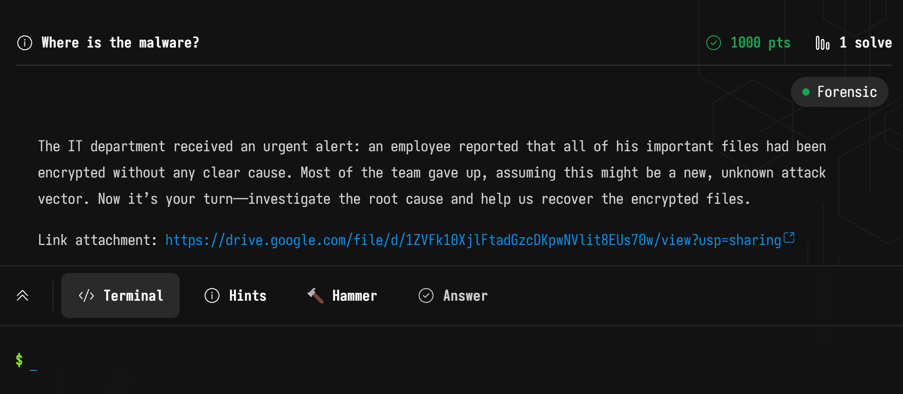
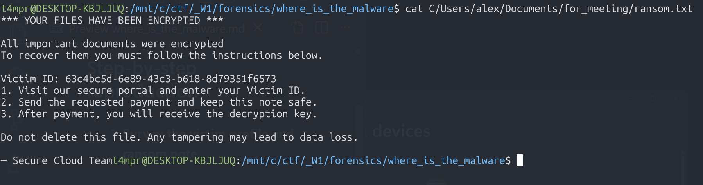
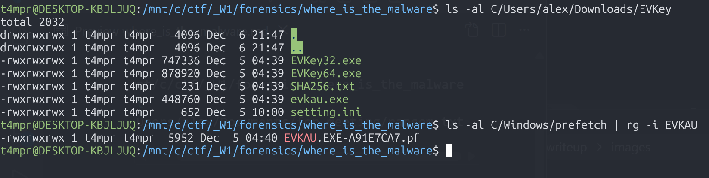
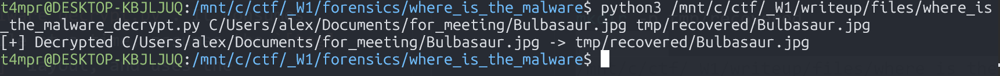
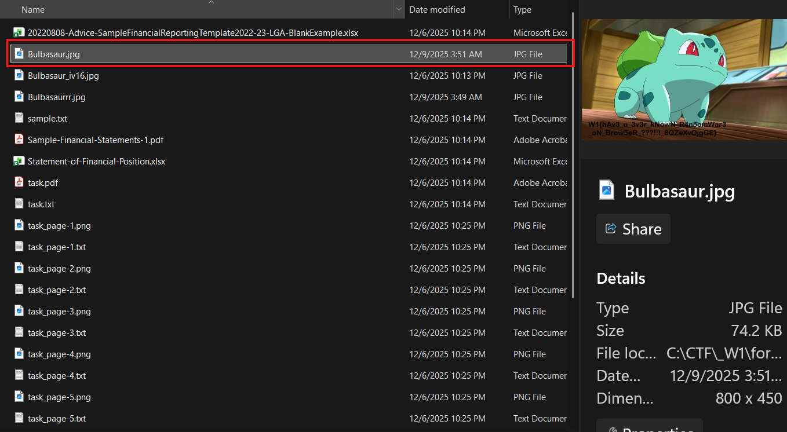

## Where is the Malware?




## Step-by-step guide

1. **Survey the victim profile and ransom note**
   ```bash
   cd /mnt/c/ctf/_W1/forensics/where_is_the_malware
   cat C/Users/alex/Documents/for_meeting/ransom.txt
   ```
   
   This confirmed Alex’s documents were encrypted and listed victim ID `63c4bc5d-6e89-43c3-b618-8d79351f6573`.

2. **Review suspicious downloads and execution traces**
   ```bash
   ls -al C/Users/alex/Downloads
   ls -al C/Users/alex/Downloads/EVKey
   ls -al C/Windows/prefetch | rg -i EVKAU
   ```
   
   The user recently ran `evkau.exe` (a fake EVKey installer) which likely staged the browser-based encryptor.

3. **Locate the malicious JavaScript payload**
   The user’s Chrome cache still held the worker that performed encryption. Searching the cache for AES usage revealed it:
   ```bash
   rg -a "AES" -n C/Users/alex/AppData/Local/Google/Chrome/User\ Data/Default/Cache/Cache_Data/f_0004ab
   ```
   
   ##### *Or just look through it manually*
   - Key excerpts from that cache file:

   ```java
   const A = "97640d7edecc04adda142fabe9760513faca90cebce7dd32f4ac6f276e60b509";
   const B = "94b4c8343e07d37ce38a87403029414e05c397dffcbfb7d1302a69a089cc79ef";
   key = hexXor(A, B);               // derives the AES-256 key
   const result = await aes.encrypt(data);
   const combined = tag + ciphertext + iv; // order written to disk
   ```
   This clarified both the key derivation (XOR of two 32‑byte constants) and the ciphertext layout: `[16-byte tag][ciphertext][16-byte nonce]`.

4. **Derive the AES-256-GCM key**
   ```bash
   python3 - <<'PY'
   from binascii import unhexlify
   a = unhexlify("97640d7edecc04adda142fabe9760513faca90cebce7dd32f4ac6f276e60b509")
   b = unhexlify("94b4c8343e07d37ce38a87403029414e05c397dffcbfb7d1302a69a089cc79ef")
   key = bytes(x ^ y for x, y in zip(a, b))
   print(key.hex())  # 03d0c54ae0cbd7d1399ea8ebd95f445dff09071140586ae3c4860687e7accce6
   PY
   ```

5. **Decrypt the victim’s files**
   See decryption helper script in `files/where_is_the_malware_decrypt.py`. 
   
   It consumes one encrypted file at a time, assumes the `[tag][ciphertext][iv]` layout, and uses the recovered key.
   Example usage:
   ```bash
   mkdir -p tmp/recovered
   python3 /mnt/c/ctf/_W1/writeup/files/where_is_the_malware_decrypt.py \
       C/Users/alex/Documents/for_meeting/Bulbasaur.jpg \
       tmp/recovered/Bulbasaur.jpg
   
   ```
   
   I repeated for each file inside `Documents/for_meeting/` 

6. **Validate and extract the flag**
   
   Once we have all the files for the `for_meeting` folder decrypted.  We simply look through our decrypted files in `tmp/recovered/`

   

  

Looking through our decrypted files, we come across this beautiful image
`Bulbasaur.jpg`


### Flag
` W1{hAv3_u_3v3r_kNowN_R4n5omWar3_oN_Brow5eR_???!!!_8QZeXvQjgGE} `
## Artifacts
- `files/where_is_the_malware_decrypt.py` – Python tool to decrypt encrypted files in this drive.

## Notes
I used GPT 5.1 Codex CLI to help me solve this challenge.  In all honesty, I gave the challenge to the LLM and was looking through it manually.  I paused and looked through all of the recovered files and realized that the flag was already there. Fully decrypted.

This got me First Blood on the challenge.  


