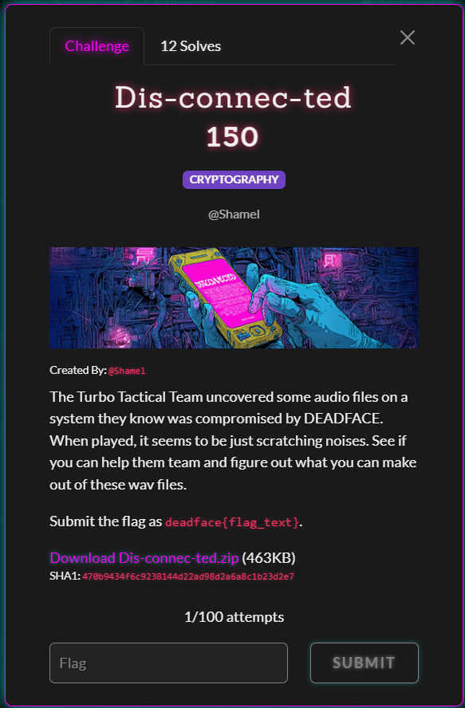
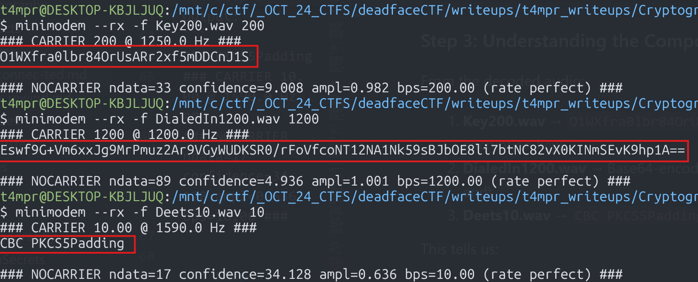
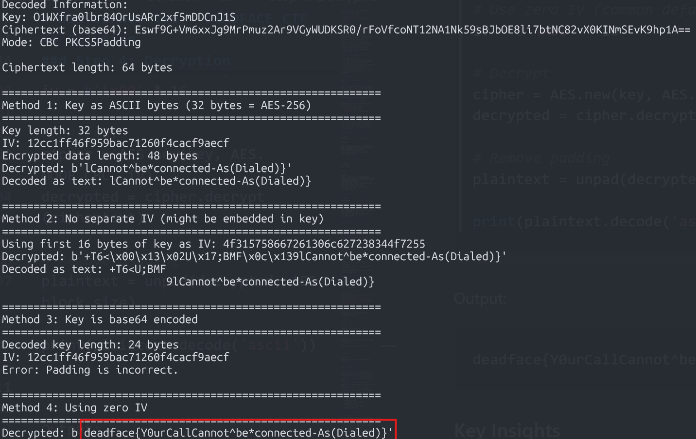
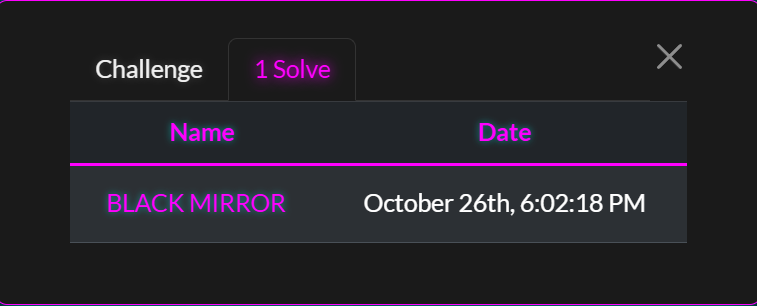

# Dis-connec-ted - DEADFACE CTF 2025 Writeup


**Category:** `CRYPTOGRAPHY` `AUDIO STEGANOGRAPHY`


## Challenge Description
 
 


>The Turbo Tactical Team uncovered some audio files on a system they know was compromised by DEADFACE. When played, it seems to be just scratching noises. See if you can help the team and figure out what you can make out of these wav files.
 >>Submit the flag as deadface{flag_text}.


## Files Provided

Three WAV audio files:
- [Key200.wav](artifacts/Key200.wav) (157 KB, 1.67 seconds)
- [Deets10.wav](artifacts/Deets10.wav) (1.6 MB, ~34 seconds)
- [DialedIn1200.wav](artifacts/DialedIn1200.wav) (70 KB, 1.49 seconds)

## Solution

### Step 1: Analyzing the Audio Files

All three files are modem audio (16-bit PCM, mono, 48000 Hz). The "scratching noises" are actually data encoded as audio tones using FSK (Frequency Shift Keying) modulation - the same technique used by old dial-up modems.

**Key Observation:** The filenames contain numbers that hint at the baud rates:
- `Key200` → 200 baud
- `Deets10` → 10 baud
- `DialedIn1200` → 1200 baud

### Step 2: Decoding with Minimodem

`minimodem` is a software modem that can decode audio signals into data. It supports various baud rates and can process WAV files directly.

**Decoding Key200.wav (200 baud):**
```bash
minimodem --rx -f Key200.wav 200
```
Output:
```
O1WXfra0lbr84OrUsARr2xf5mDDCnJ1S
### CARRIER 200 @ 1250.0 Hz ###
### NOCARRIER ndata=33 confidence=9.008 ampl=0.982 bps=200.00 ###
```

**Decoding DialedIn1200.wav (1200 baud):**
```bash
minimodem --rx -f DialedIn1200.wav 1200
```
Output:
```
Eswf9G+Vm6xxJg9MrPmuz2Ar9VGyWUDKSR0/rFoVfcoNT12NA1Nk59sBJbOE8li7btNC82vX0KINmSEvK9hp1A==
### CARRIER 1200 @ 1200.0 Hz ###
### NOCARRIER ndata=89 confidence=4.936 ampl=1.001 bps=1200.00 ###
```

**Decoding Deets10.wav (10 baud):**
```bash
minimodem --rx -f Deets10.wav 10
```
Output:
```
CBC PKCS5Padding
### CARRIER 10.00 @ 1590.0 Hz ###
### NOCARRIER ndata=17 confidence=34.128 ampl=0.636 bps=10.00 ###
```

### Step 3: Understanding the Components



From the decoded audio:
1. **Key200.wav** → `O1WXfra0lbr84OrUsARr2xf5mDDCnJ1S` (32 characters = encryption key)
2. **DialedIn1200.wav** → Base64-encoded ciphertext (note the `==` padding at the end)
3. **Deets10.wav** → `CBC PKCS5Padding` (encryption mode details)

This tells us:
- Encryption algorithm: AES (implied by CBC mode and 32-byte key)
- Mode: CBC (Cipher Block Chaining)
- Padding: PKCS5 (same as PKCS7 for AES)
- Key: 32 ASCII characters = 32 bytes = AES-256

### Step 4: Decryption

```python
from Crypto.Cipher import AES
from Crypto.Util.Padding import unpad
import base64

# Decoded values
key_string = "O1WXfra0lbr84OrUsARr2xf5mDDCnJ1S"
ciphertext_b64 = "Eswf9G+Vm6xxJg9MrPmuz2Ar9VGyWUDKSR0/rFoVfcoNT12NA1Nk59sBJbOE8li7btNC82vX0KINmSEvK9hp1A=="

# Prepare for decryption
key = key_string.encode('ascii')  # Convert to bytes
ciphertext = base64.b64decode(ciphertext_b64)

# Use zero IV (common default when IV not specified)
iv = b'\x00' * 16

# Decrypt
cipher = AES.new(key, AES.MODE_CBC, iv)
decrypted = cipher.decrypt(ciphertext)

# Remove padding
plaintext = unpad(decrypted, AES.block_size)

print(plaintext.decode('ascii'))
```

$ ``` python3 dis-connec-ted_decrypt.py```



Output:
```
deadface{Y0urCallCannot^be*connected-As(Dialed)}
```

`🩸 FIRST BLOOD 🩸 `  

 

### Key Insights

1. **Baud Rate Hints**: The numbers in filenames indicated the baud rates needed for decoding
2. **Modem Audio**: "Scratching noises" were FSK-modulated modem signals
3. **Zero IV**: When no IV is explicitly provided, a zero IV is commonly used
4. **Retro Theme**: The flag references the classic telephone message "Your call cannot be connected as dialed"
5. **File Order**:
   - Slowest (10 baud) → Mode/padding info
   - Medium (200 baud) → Encryption key
   - Fastest (1200 baud) → Encrypted data

### Why This Works

**Zero IV Assumption:**
In CBC mode, you typically need both a key and an initialization vector (IV). Since only three pieces of information were provided (key, ciphertext, mode), and no separate IV was transmitted, the implementation likely used a zero IV (all null bytes). This is a common simplification in CTF challenges and occasionally in real-world implementations (though it's cryptographically weaker).

**Alternative IV Sources Tested:**
- First 16 bytes of ciphertext as IV (Method 1) - produced garbled text
- First 16 bytes of key as IV (Method 2) - produced garbled text
- Base64-decoded key (Method 3) - failed with padding error
- Zero IV (Method 4) - **SUCCESS!**

## Flag

`deadface{Y0urCallCannot^be*connected-As(Dialed)}`

## Tools Used

- `minimodem` - Software modem for audio decoding
- Python 3 with pycryptodome
- `file` and `exiftool` for file analysis

## References

- FSK (Frequency Shift Keying) modulation
- AES-256-CBC encryption
- PKCS5/PKCS7 padding
- Base64 encoding
