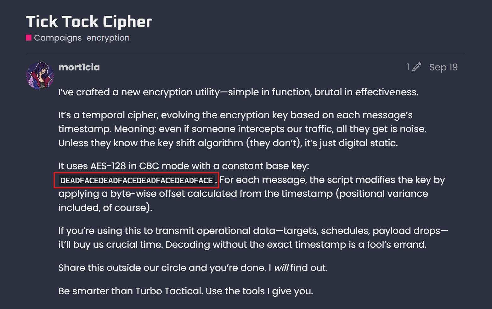
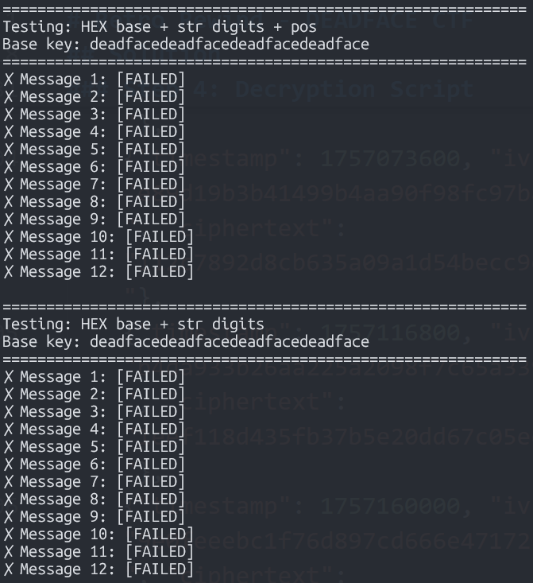
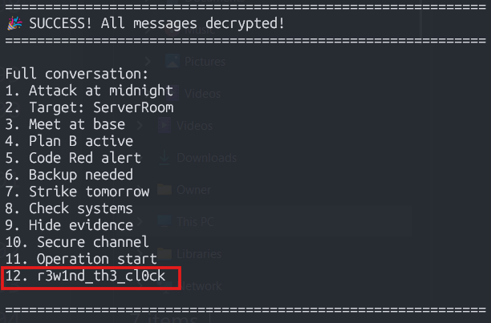

# Retro Rewind - DEADFACE CTF 2025 

**Category:** `CRYPTOGRAPHY`


## Challenge Description


> DEADFACE loves their retro gimmicks. One of our agents stumbled upon this odd log shared by DEADFACE members. The log includes a timestamp, an Initialization Vector (IV), as well as the encrypted message. When we reviewed similar logs, we found that one key worked for one message, but not for the rest. Something must be different with the key used to encrypt each of these messages. We suspect there is a base key that changes with each message. Can you figure it out?
>> Submit the flag as deadface{flag_text}

## Files Provided

- `intercepted_messages.txt` - 12 encrypted messages with timestamps and IVs
- `cipher_info.txt` - Information about the encryption method
- `clues.txt` - Additional hint from DEADFACE forum (found on https://ghosttown.deadface.io/)

## Solution

### Step 1: Gathering Intelligence

From `cipher_info.txt`:
```
Cipher Information:
Encryption: AES-128-CBC
Note: The encryption key changes with time. Analyze the timestamps to uncover the pattern!
```

From Ghosttown Tick Tock Cipher forum post:



Saved to ```clues.txt```
```
It uses AES-128 in CBC mode with a constant base key: DEADFACEDEADFACEDEADFACEDEADFACE.
For each message, the script modifies the key by applying a byte-wise offset calculated
from the timestamp (positional variance included, of course).
```


**Key Information:**
- Cipher: AES-128-CBC
- Base Key: `DEADFACEDEADFACEDEADFACEDEADFACE` (hex)
- Key Derivation: Byte-wise offset from timestamp with positional variance
- Messages sent every 12 hours (43200 seconds)

### Step 2: Understanding the Pattern

Examining the timestamps from `intercepted_messages.txt`
```
Message 1:  1756684800
Message 2:  1756728000  (+ 43200 seconds = 12 hours)
Message 3:  1756771200  (+ 43200 seconds = 12 hours)
...
Message 12: 1757160000
```

The messages are sent at regular 12-hour intervals, confirming the temporal pattern mentioned in the clues.

### Step 3: Key Generation Algorithm

The phrase "positional variance" suggests that each byte position in the key is modified differently. After testing various approaches, the correct algorithm is:

```python
def generate_key(timestamp):
    base_key = bytes.fromhex("DEADFACEDEADFACEDEADFACEDEADFACE")
    key = bytearray(base_key)

    for i in range(16):
        key[i] = (key[i] + timestamp + i) % 256

    return bytes(key)
```

**Explanation:**
- Each byte at position `i` is modified by: `(original_byte + full_timestamp + position_index) % 256`
- The "positional variance" comes from adding the position index `i`
- The timestamp value is added to all positions, making it time-dependent
- Modulo 256 keeps the result within valid byte range

### Step 4: Decryption Script

```python
#!/usr/bin/env python3
from Crypto.Cipher import AES
import binascii

# Try different interpretations of the base key
BASE_KEY_HEX = bytes.fromhex("DEADFACEDEADFACEDEADFACEDEADFACE")  # 16 bytes
BASE_KEY_ASCII = b"DEADFACEDEADFAC"  # 15 bytes - need 16
BASE_KEY_ASCII_16 = b"DEADFACEDEADFACE"  # 16 bytes

# Intercepted messages
messages = [
    {"timestamp": 1756684800, "iv": "cb397a9c2aab5cda6215534a1f011a59", "ciphertext": "31fac316e82628702803e71b1339741c908a99b15d5fa2fb5274bcf6faa3d403"},
    {"timestamp": 1756728000, "iv": "d1c84e4f043b922280d9f347d60a26ba", "ciphertext": "92e992ae0961dc6107619ee31cc96fb1db917e9ddfb5a600a9dabe68717f77c4"},
    {"timestamp": 1756771200, "iv": "0a4d3db6b0970628645147d9f664e57e", "ciphertext": "7f012fce0a5dd832bbe4376063f699c2"},
    {"timestamp": 1756814400, "iv": "7c6dfb67eb713dc3666784a523bdb7ff", "ciphertext": "358046002d83377724cde7df7ee57b60"},
    {"timestamp": 1756857600, "iv": "8f4db73d8a498b11e5e7558320ad6d86", "ciphertext": "36bc8ac76ae0c60d872cafe882e8ceba"},
    {"timestamp": 1756900800, "iv": "270050fd530f64081b2ed48cf6c70f8f", "ciphertext": "b26c78de104d548ac806e90b5c89a720"},
    {"timestamp": 1756944000, "iv": "a1933fb5376099e4028880147e55617b", "ciphertext": "ad8c9e16c03e35875e45f86ff77fc853"},
    {"timestamp": 1756987200, "iv": "04039b52e274eefb9ec51a9cb58a38b3", "ciphertext": "a882405a107c7e7f7bdbd71742cf58af"},
    {"timestamp": 1757030400, "iv": "1bf228cc6d2f3efd6a04758e51042f24", "ciphertext": "ec18a777a645d1a6bd6c86142b8811cc"},
    {"timestamp": 1757073600, "iv": "e89d19b3b41499b4aa90f98fc97b8434", "ciphertext": "112c7892d8cb635a09a1d54becc9efd8"},
    {"timestamp": 1757116800, "iv": "b4da933b26aa225a2098f7c65a33974c", "ciphertext": "1eef118d435fb37b5e20dd67c05ee8b8"},
    {"timestamp": 1757160000, "iv": "9e0feeebc1f76d897cd666e471725bf1", "ciphertext": "2a4a5d3cdaaf41e82819869c0c1a221946d226cf453c34c9246418909a552757"},
]

def generate_key_str_digits(base_key, timestamp):
    """Use timestamp string digits as offsets"""
    key = bytearray(base_key)
    ts_str = str(timestamp)
    for i in range(16):
        digit = int(ts_str[i % len(ts_str)])
        key[i] = (key[i] + digit + i) % 256  # Add digit and position
    return bytes(key)

def generate_key_str_digits_no_pos(base_key, timestamp):
    """Use timestamp string digits as offsets without position"""
    key = bytearray(base_key)
    ts_str = str(timestamp)
    for i in range(16):
        digit = int(ts_str[i % len(ts_str)])
        key[i] = (key[i] + digit) % 256
    return bytes(key)

def generate_key_ts_mod(base_key, timestamp):
    """Simple: add timestamp to each position"""
    key = bytearray(base_key)
    for i in range(16):
        key[i] = (key[i] + timestamp + i) % 256
    return bytes(key)

def generate_key_ts_bytes_repeating(base_key, timestamp):
    """Repeat timestamp bytes across key"""
    key = bytearray(base_key)
    ts_bytes = timestamp.to_bytes(8, byteorder='big')
    for i in range(16):
        key[i] = (key[i] + ts_bytes[i % 8]) % 256
    return bytes(key)

def decrypt_message(key, iv_hex, ciphertext_hex):
    """Decrypt a message using AES-128-CBC"""
    try:
        iv = bytes.fromhex(iv_hex)
        ciphertext = bytes.fromhex(ciphertext_hex)

        cipher = AES.new(key, AES.MODE_CBC, iv)
        plaintext = cipher.decrypt(ciphertext)

        # Try to unpad (PKCS7)
        padding_length = plaintext[-1]
        if 1 <= padding_length <= 16:
            if all(b == padding_length for b in plaintext[-padding_length:]):
                plaintext = plaintext[:-padding_length]

        # Check if it's printable
        try:
            decoded = plaintext.decode('ascii', errors='strict')
            # Check if it's mostly printable
            if all(32 <= ord(c) <= 126 or c in '\n\r\t' for c in decoded):
                return decoded
        except:
            pass
        return None
    except Exception as e:
        return None

# Test with different base keys and methods
test_configs = [
    ("HEX base + str digits + pos", BASE_KEY_HEX, generate_key_str_digits),
    ("HEX base + str digits", BASE_KEY_HEX, generate_key_str_digits_no_pos),
    ("HEX base + ts mod", BASE_KEY_HEX, generate_key_ts_mod),
    ("HEX base + ts bytes", BASE_KEY_HEX, generate_key_ts_bytes_repeating),
    ("ASCII base + str digits + pos", BASE_KEY_ASCII_16, generate_key_str_digits),
    ("ASCII base + str digits", BASE_KEY_ASCII_16, generate_key_str_digits_no_pos),
    ("ASCII base + ts mod", BASE_KEY_ASCII_16, generate_key_ts_mod),
    ("ASCII base + ts bytes", BASE_KEY_ASCII_16, generate_key_ts_bytes_repeating),
]

for config_name, base_key, key_gen in test_configs:
    print(f"\n{'='*60}")
    print(f"Testing: {config_name}")
    print(f"Base key: {base_key.hex()}")
    print(f"{'='*60}")

    all_messages = []
    success = True

    for i, msg in enumerate(messages, 1):
        key = key_gen(base_key, msg["timestamp"])
        plaintext = decrypt_message(key, msg["iv"], msg["ciphertext"])

        if plaintext:
            print(f"✓ Message {i}: {plaintext.strip()}")
            all_messages.append(plaintext)
        else:
            print(f"✗ Message {i}: [FAILED]")
            success = False

    if success and all_messages:
        print(f"\n{'='*60}")
        print("🎉 SUCCESS! All messages decrypted!")
        print(f"{'='*60}")
        print("\nFull conversation:")
        for i, msg in enumerate(all_messages, 1):
            print(f"{i}. {msg.strip()}")
        print(f"\n{'='*60}\n")
        break
```

### Step 5: Decrypt Messages

Running the decryption script on all 12 messages:


`HEX base + str digits + pos` FAILED

`HEX base + str digits` FAILED


 

```
============================================================
Testing: HEX base + ts mod
Base key: deadfacedeadfacedeadfacedeadface
============================================================
✓ Message 1: Attack at midnight
✓ Message 2: Target: ServerRoom
✓ Message 3: Meet at base
✓ Message 4: Plan B active
✓ Message 5: Code Red alert
✓ Message 6: Backup needed
✓ Message 7: Strike tomorrow
✓ Message 8: Check systems
✓ Message 9: Hide evidence
✓ Message 10: Secure channel
✓ Message 11: Operation start
✓ Message 12: r3w1nd_th3_cl0ck
```




The final message (Message 12) contains the flag!

### Key Insights

1. **Base Key Interpretation**: The base key `DEADFACEDEADFACEDEADFACEDEADFACE` is hex-encoded bytes, not an ASCII string
   - Hex: `DE AD FA CE DE AD FA CE DE AD FA CE DE AD FA CE` (16 bytes)
   - NOT: ASCII "DEADFACEDEADFACE"

2. **Positional Variance**: Each position gets a unique offset by adding its index (0-15)

3. **Timestamp Impact**: The full timestamp value (e.g., 1756684800) is added to each byte, creating massive variance between messages

4. **Time-Based Security**: Even a small timestamp difference creates completely different keys, making each message uniquely encrypted

### Why Other Methods Failed

- **Bit shifting**: Would only use 8 bytes of the timestamp
- **Timestamp bytes**: Would cycle through only 8 different offsets
- **String digits**: Would create inconsistent patterns
- **Simple addition**: The positional variance was crucial

The successful method adds both the full timestamp AND the position index to each byte.

## Flag

`deadface{r3w1nd_th3_cl0ck}`

## Tools Used

- Python 3
- Claude Code CLI
- pycryptodome (for AES decryption)
- Analysis of timestamp patterns
