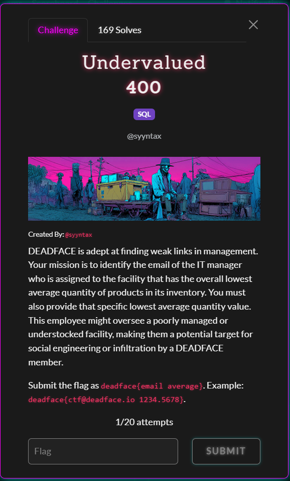
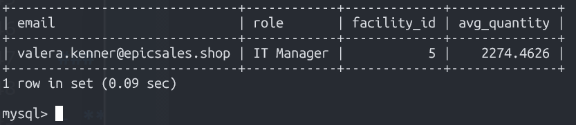

# Undervalued - DEADFACE CTF 2025

**Category:** `SQL`

## Challenge Description



> DEADFACE is adept at finding weak links in management. Your mission is to identify the email of the IT manager who is assigned to the facility that has the overall lowest average quantity of products in its inventory. You must also provide that specific lowest average quantity value. This employee might oversee a poorly managed or understocked facility, making them a potential target for social engineering or infiltration by a DEADFACE member.
>>Submit the flag as deadface{email average}. 
>>>Example: deadface{ctf@deadface.io 1234.5678}.

**Database Connection:**
- Host: `env01.deadface.io:3306`
- Username: `epicsales`
- Password: `Slighted3-Charting-Valium`
- Database: `epicsales_db`

## Solution

### Step 1: Database Exploration

First, connect to the database and explore the schema:

```bash
mysql -h env01.deadface.io -P 3306 -u epicsales -p'Slighted3-Charting-Valium' epicsales_db
```

List all tables:

```sql
SHOW TABLES;
```

**Output:**
```
categories
customers
employee_assignments
employees
facilities
inventories
loyalty_points
order_items
orders
products
reviews
```

### Step 2: Understanding the Schema

Based on the challenge requirements, we need to work with:
- `inventories` - contains product quantities per facility
- `facilities` - facility information
- `employees` - employee information including roles
- `employee_assignments` - links employees to facilities

Let's examine the relevant table structures:

```sql
DESCRIBE facilities;
DESCRIBE inventories;
DESCRIBE employees;
DESCRIBE employee_assignments;
```

**Key findings:**
- `inventories` table has: `inventory_id`, `product_id`, `facility_id`, `quantity`
- `employees` table has: `employee_id`, `email`, `role`, and other personal info
- `employee_assignments` links: `employee_id` to `facility_id`
- `employees.role` contains values like "IT Manager"

### Step 3: Find Facility with Lowest Average Inventory

Calculate the average quantity of products per facility:

```sql
SELECT
    facility_id,
    AVG(quantity) as avg_quantity
FROM inventories
GROUP BY facility_id
ORDER BY avg_quantity ASC
LIMIT 5;
```

**Output:**
```
facility_id | avg_quantity
------------|-------------
5           | 2274.4626
20          | 2329.8722
25          | 2343.9119
7           | 2359.5286
10          | 2363.8634
```

**Result:** Facility ID `5` has the lowest average inventory quantity of `2274.4626`.

### Step 4: Identify IT Manager Roles

Verify the exact role name for IT managers:

```sql
SELECT DISTINCT role
FROM employees
WHERE role LIKE '%IT%' OR role LIKE '%manager%';
```

**Output includes:**
```
IT Manager
IT Support Specialist
Product Manager
Finance Manager
Warehouse Manager
HR Manager
Customer Relations Manager
Sales Manager
```

The role we need is exactly: `IT Manager`

### Step 5: Find IT Manager for Facility 5

Query to find the IT Manager assigned to facility 5:

```sql
SELECT
    e.email,
    e.role,
    ea.facility_id,
    (SELECT AVG(quantity) FROM inventories WHERE facility_id = 5) as avg_quantity
FROM employees e
JOIN employee_assignments ea ON e.employee_id = ea.employee_id
WHERE ea.facility_id = 5
  AND e.role = 'IT Manager';
```

**Output:**


```
email                           | role       | facility_id | avg_quantity
--------------------------------|------------|-------------|-------------
valera.kenner@epicsales.shop    | IT Manager | 5           | 2274.4626
```

### Solution Summary

- **IT Manager Email:** `valera.kenner@epicsales.shop`
- **Facility ID:** 5
- **Average Inventory Quantity:** `2274.4626`

**Flag:** `deadface{valera.kenner@epicsales.shop 2274.4626}`

## Key Takeaways

1. **Aggregation Functions:** Using `AVG()` with `GROUP BY` to calculate averages per group
2. **JOIN Operations:** Connecting employees to facilities through the assignment table
3. **Filtering:** Using `WHERE` clauses to filter by role and facility
4. **Ordering:** Using `ORDER BY` with `ASC` to find minimum values
5. **Subqueries:** Using subqueries to retrieve aggregate values in the final result

## Alternative Solution (Single Query)

You could also solve this with a single comprehensive query:

```sql
SELECT
    e.email,
    AVG(i.quantity) as avg_quantity
FROM employees e
JOIN employee_assignments ea ON e.employee_id = ea.employee_id
JOIN inventories i ON i.facility_id = ea.facility_id
WHERE e.role = 'IT Manager'
GROUP BY e.email, ea.facility_id
ORDER BY avg_quantity ASC
LIMIT 1;
```

This would directly return the IT manager with the lowest average inventory in their assigned facility.
