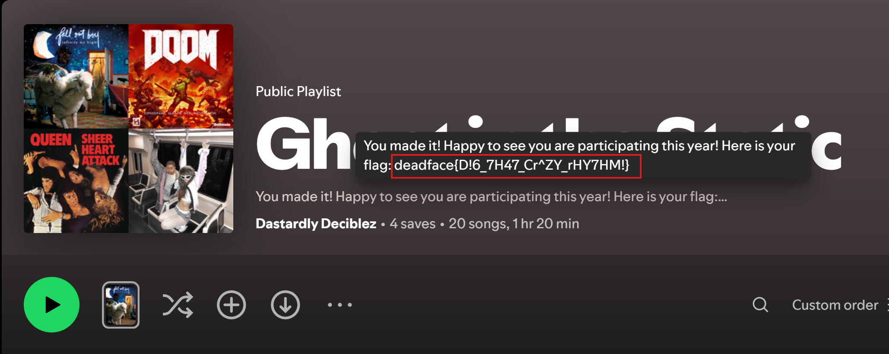

# DISS TRACK - DEADFACE CTF Writeup

**Category:** `OSINT`

## Challenge Description
 

>We where looking at the message board and saw that lilith and deephax communicated that they would have a secret way of talking to each other while they ran an attack. We cant make heads or tales of it but we did note that they mentioned Band names and referenced some songs.
>>Enter the answer as deadface{flag text}.

## DISS TRACK - OSINT

- Clues from message board 
https://ghosttown.deadface.io/t/how-do-y-all-decompress-after-ops/84/9
- Conversation between lillith and deephax "Hey Deep, Since you like music so much I put something together for that THING that’s happening.
check it out tell me what you think
34qdvkzNI5IIZUR5kVOpNx"

### Solve

Pasting the 34qdvkzNI5IIZUR5kVOpNx part of what she said into https://open.spotify.com/playlist/34qdvkzNI5IIZUR5kVOpNx
reveals the flag.

``deadface{D!6_7H47_Cr^ZY_rHY7HM!}`` 