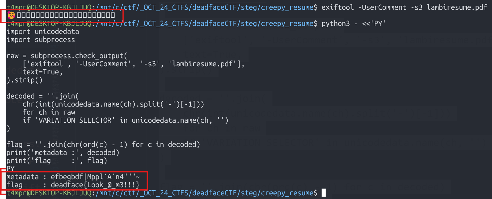
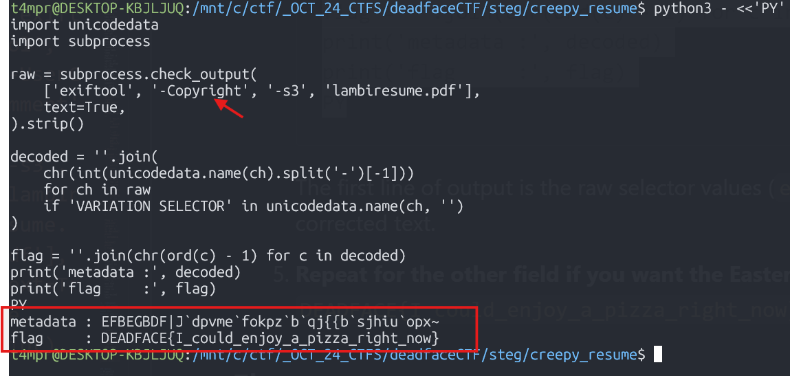

# Creepy Resume - DEADFACE CTF 2025

**Category:** `STEG`


## Challenge Description
 

>A DEADFACE member landed an interview at Spooky Coffee using a resume that whispers in Unicode and charms every AI it touches. Those who can read between the glyphs say it speaks in riddles, crafted to bypass filters and impress any CAPTCHA-checking HR daemon.
>>Analyze the resume PDF. Can you find the secret string?
>>>Submit the flag as deadface{here_is_the_answer}.

## Recon

- [Smuggling arbitrary data through an emoji](https://paulbutler.org/2025/smuggling-arbitrary-data-through-an-emoji/)
- [Anyone mess with hiding data in emojis? ](https://ghosttown.deadface.io/t/anyone-mess-with-hiding-data-in-emojis/81) - Ghosttown Forum
- [emoji-encoder repo](https://github.com/paulgb/emoji-encoder/tree/main)
- [ emoji decoder](https://emoji.paulbutler.org/?mode=decode) - Easy solve
## Working Environment
- WSL Ubuntu 
- Tools: `pdfinfo`, `exiftool`, `python3` 

## What I did
1. **Confirm the document is the expected PDF.**
   ```bash
   pdfinfo lambiresume.pdf
   ```
   The metadata looks ordinary except for a surprisingly recent `Producer`, so we move on to the richer metadata dump.

2. **Dump all metadata and look for fields that contain unusual glyphs.**
   ```bash
   exiftool lambiresume.pdf
   ```

   `UserComment` and `Copyright` each show an emoji (`🥰`) followed by dozens of blank-looking characters. These glyphs render as tofu because they live in Unicode Plane 14 (the same plane referenced in the organizer's links about "emoji smuggling").

3. **Extract just the suspicious string without field labels.**
   ```bash
    exiftool -UserComment -s3 lambiresume.pdf
   ```
   Copy the output somewhere safe; we'll decode it with Python in the next step. 

4. **Decode the Plane‑14 variation selectors.**
   Variation selectors from U+E0100–U+E01EF are named `VARIATION SELECTOR-n`. The numeric suffix is exactly the ASCII code of the intended character. A quick script turns the selector sequence into readable text and then applies a Caesar shift of -1 (hinted by the trailing tilde `~`, the last printable ASCII symbol).
   ```bash
   python3 - <<'PY'
   import unicodedata
   import subprocess

   raw = subprocess.check_output(
       ['exiftool', '-UserComment', '-s3', 'lambiresume.pdf'],
       text=True,
   ).strip()

   decoded = ''.join(
       chr(int(unicodedata.name(ch).split('-')[-1]))
       for ch in raw
       if 'VARIATION SELECTOR' in unicodedata.name(ch, '')
   )

   flag = ''.join(chr(ord(c) - 1) for c in decoded)
   print('metadata :', decoded)
   print('flag     :', flag)
   PY
   ```
   The first line of output is the raw selector values (`efbegbdf|Mppl\`A\`n4"""~`), and the second line is the corrected text.

   

5. **Repeat for the other field if you want the Easter egg.**
   Replace `-UserComment` with `-Copyright` to reveal `DEADFACE{I_could_enjoy_a_pizza_right_now}` after the same -1 shift.
   

## Flag
`deadface{Look_@_m3!!!}`

## Easy Solve

I'm pretty surwe that the intended solve here was to review the info and links from the Ghosttown Forum post where you found find the emoji decoder. 

- ```exiftool lambiresume.pdf```
- Copy `🥰󠅔󠅕󠅑󠅔󠅖󠅑󠅓󠅕󠅫󠄼󠅟󠅟󠅛󠅏󠄰󠅏󠅝󠄣󠄑󠄑󠄑󠅭`
- Paste in https://emoji.paulbutler.org/?mode=decode


## Notes
- Plane‑14 variation selectors survive most sanitizers because they are officially sanctioned Unicode code points even though they have no obvious glyph.
- The `paulbutler.org` and `emoji-encoder` links discuss the same trick but with Emoji Tag Sequences; here the author reused the idea with variation selectors and an additional Caesar shift.
