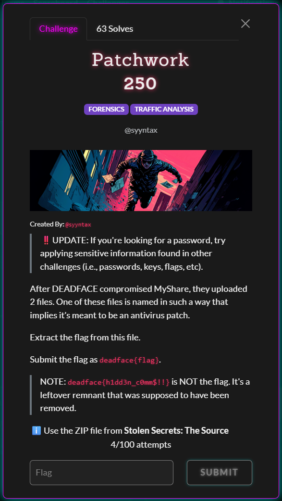
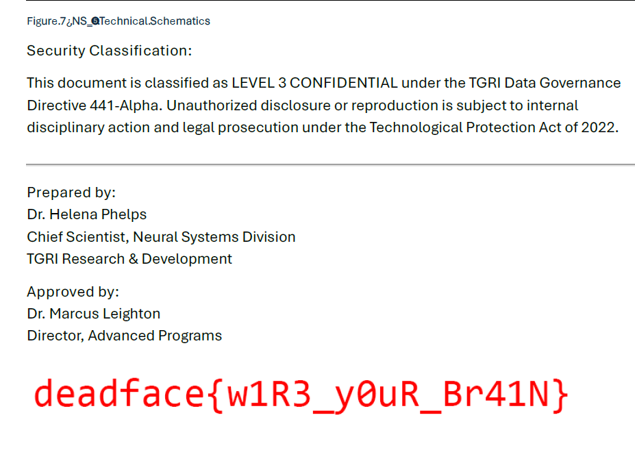

# Patchwork - DEADFACE CTF 2025 Writeup

**Category:** `FORENSICS` `TRAFFIC ANALYSIS`


## Challenge Description
 

>‼️UPDATE: If you're looking for a password, try applying sensitive information found in other challenges (i.e., passwords, keys, flags, etc).
>>-After DEADFACE compromised MyShare, they uploaded 2 files. One of these files is named in such a way that implies it’s meant to be an antivirus patch.
>>>Extract the flag from this file.
>>>>Submit the flag as deadface{flag}.
>>>>>NOTE: deadface{h1dd3n_c0mm$!!} is NOT the flag. It's a leftover remnant that was supposed to have been removed.

## Solution

### Tools Used
- tshark
- Python 3
- unzip
- file
- strings

### Analysis

This challenge required extracting a file uploaded to the MyShare application and then analyzing it to extract the flag.

#### Step 1: Identifying File Uploads

First, I searched for file uploads in the PCAP:

```bash
tshark -r cap-1753106207.pcap -Y "http.request.method == POST && http.content_type contains \"multipart\"" \
  -T fields -e frame.number -e http.request.uri -e http.content_type
```

This revealed two file uploads:
- Frame 30859: `info.php` (4481 bytes)
- Frame 31565: `av_updater.zip` (14269626 bytes)

The second file, `av_updater.zip`, matched the description of an "antivirus patch".

#### Step 2: Extracting the ZIP File

I needed to extract the uploaded ZIP file from the network traffic. I used tshark to follow the TCP stream:

```bash
tshark -r cap-1753106207.pcap -Y 'frame.number == 31565' -T fields -e tcp.stream
# Output: 3605

tshark -r cap-1753106207.pcap -q -z follow,tcp,raw,3605 > stream_3605_hex.txt
```

Then I wrote a Python script to extract the ZIP file from the hex stream:

```python
# Read and convert hex stream to binary
with open('stream_3605_hex.txt', 'r') as f:
    hex_data = f.read()
hex_data = hex_data.replace('\t', '').replace('\n', '').replace(' ', '')
binary_data = bytes.fromhex(hex_data)

# Find av_updater.zip in the multipart upload
av_updater_pos = binary_data.find(b'filename="av_updater.zip"')
zip_start = binary_data.find(b'PK\x03\x04', av_updater_pos)

# Find the multipart boundary
boundary = b'-----------------------------40227934409581540873588663892'
zip_end = binary_data.find(boundary, zip_start + 100)
zip_data = binary_data[zip_start:zip_end].rstrip(b'\r\n')

# Write the ZIP file
with open('av_updater_real.zip', 'wb') as f:
    f.write(zip_data)
```

This extracted a 14MB ZIP file.

#### Step 3: Password-Protected Archive

Attempting to extract the ZIP revealed it was password-protected:

```bash
unzip -l av_updater_real.zip
```

Output:
```
  Length      Date    Time    Name
---------  ---------- -----   ----
  8095496  2025-07-20 19:02   av_lin_update
  6446961  2025-07-20 19:00   av_win_update.exe
```

The challenge hint mentioned using "sensitive information found in other challenges" as passwords. After examining the PCAP, I found credentials used to login to MyShare:

- Username: `bsampsel`
- Password: `Sparkles2025!`

This wasn't correct.  However, the actual password was: **`w1R3_y0uR_Br41N`** (extracted from the previous challenge in the series printed on the bottom of a a PDF).

 


#### Step 4: Extracting and Analyzing the Binaries

```bash
unzip -P "w1R3_y0uR_Br41N" av_updater_real.zip -d av_updater_real_extracted
```

This extracted two files:
- `av_lin_update` - ELF 64-bit LSB executable
- `av_win_update.exe` - PE32+ executable

Both appeared to be PyInstaller-packaged executables.

#### Step 5: Finding the Flag

Running the Linux binary revealed the flag:

```bash
chmod +x av_updater_real_extracted/av_lin_update
./av_updater_real_extracted/av_lin_update --help
```

Output:


```
The flag is: deadface{m4lici0uS_uPl04D}
```

### Key Findings

- DEADFACE uploaded a malicious file disguised as an antivirus patch
- The file `av_updater.zip` contained two executables (Linux and Windows versions)
- The ZIP was password-protected with `w1R3_y0uR_Br41N`
- The executables were PyInstaller-packaged Python applications
- Running the binary immediately displays the flag, confirming it's malicious

### Additional Context

The PCAP also contained other stolen files:
- `ns-9.png` - Image of a neural interface diagram (1.5MB)
- `2025-06-20_phelps.helena.txt` - Confidential emails about Project Neutron Silk
- `tgri-rnd-2025-0719.pdf` - Technical report on NS-9 adaptive nanomesh technology

These files provided context about the "MyShare" application breach at Tech Global Research Industries (TGRI).

### Flag

`deadface{m4lici0uS_uPl04D}`
